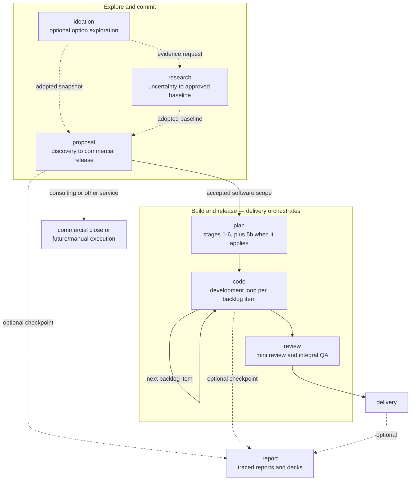

# Quasar AI delivery skills

This package is a coordinated catalog of Agent Skills for running a software consultancy's delivery flow end to end: explore an opportunity, win it commercially, plan and build the software, review it, deliver it, and report on it. Twelve groups organize the catalog; shared governance keeps every skill narrow, auditable, and honest about what it did. Start with `skill-manifest.yaml` — it is the canonical registry for skill IDs, paths, routing, side effects, approval policies, and compatibility.

## Install

Install into any [Agent Skills](https://agentskills.io) client — Claude Code, Cursor, Codex, and others — with the [skills.sh](https://skills.sh) CLI:

```bash
npx skills add flaviogragnolati/ai-workflow            # choose interactively
npx skills add flaviogragnolati/ai-workflow --list     # inspect first
npx skills add flaviogragnolati/ai-workflow --skill q-code-debug --skill q-review-code
```

The installer copies one skill folder at a time into your project's agent directory, where every skill becomes a sibling of every other. Each skill is operationally self-contained: it either bundles what it needs or declares the companion it depends on. Install the dependencies listed under [Skill dependencies](#skill-dependencies) alongside the skill that requires them; a skill whose companion is missing stops and prints the exact install command instead of proceeding on assumed rules.

[`LICENSE`](LICENSE) at the repository root is the sole package license and third-party attribution catalog. It lists the external repositories used as references, the affected Quasar skills, source revisions, adaptation scope, and applicable terms. Skill directories do not duplicate that catalog; licenses belonging to bundled third-party dependencies remain with those dependencies.

This package remains prerelease. `CHANGELOG.md` records work under `Unreleased`; no stable package version or release tag is established by the current repository state.

Skill IDs follow `q-<group>-<leaf>`, so the catalog stays recognizable in a shared agent directory and sorts by group. `q-maint-ai-workflow`, `q-maint-writing-for-agents`, and `q-maint-skill-quality` are `distribution: internal` and are not offered to consumers; the remaining 57 are. `skills.sh.json` groups the catalog on the skills.sh repository page as a derived presentation of the manifest `group` field.

## Philosophy

Eight invariants govern every workflow and skill in this package:

1. **Human judgment stays in charge** of scope, commitments, irreversible actions, and governance changes.
2. **Skills are narrow and composable**, with explicit ownership boundaries. Orchestrators route, reconcile, and write global state; they never duplicate domain procedure.
3. **Context is a budget.** An agent loads only the route and references the current task needs.
4. **Each meaning has one authoritative source.** Every other surface is a pointer or a derived view — including this README and the group guides.
5. **Changes are small and verification is proportional to risk.** Ceremony such as tickets and TDD stays optional.
6. **Artifacts declare authority, lifecycle, stable IDs, and provenance.** A derived presentation never silently becomes semantic truth.
7. **Compatibility is stated honestly.** A missing capability produces an explicit gap, never a false approval.
8. **External or irreversible side effects are explicit and approval-gated.**

`skills/core/q-core-contract/SKILL.md` turns these invariants into the shared operating contract that coordinated skills load before acting. The manifest declares, per skill, the execution modes, side effects, approval policy, and fallback that make them enforceable.

## Skill groups

Each linked guide explains one group in depth: its internal flow, a when-to-use table for every skill, and how it connects to the rest.

| Group | Skills | What it covers | Guide |
|---|---:|---|---|
| `ask` | 2 | Bounded answers from project truth and read-only proposal analysis | below |
| `ideation` | 1 | Optional structured exploration of one decision's option space | below |
| `proposal` | 5 | Client evidence to discovery brief, canonical proposal, and web/document channels | [proposal guide](skills/proposal/README.md) |
| `research` | 5 | A named external uncertainty to an approved, cited baseline | [research guide](skills/research/README.md) |
| `delivery` | 1 | The orchestrator that routes planning, iteration, QA, and delivery | [delivery guide](skills/delivery/README.md) |
| `plan` | 7 | Ordered planning stages from product intent to a validated backlog | [plan guide](skills/plan/README.md) |
| `code` | 15 | The development loop: orient, refine, implement, and handle trouble | [code guide](skills/code/README.md) |
| `review` | 6 | QA that never modifies its target: changes, releases, documentation, evidence, and skills | [review guide](skills/review/README.md) |
| `report` | 4 | Approved artifacts to a traced report and its rendered channels | [report guide](skills/report/README.md) |
| `tool` | 10 | Format, web-capture, and diagram mechanics any caller can delegate to | [tool guide](skills/tool/README.md) |
| `core` | 1 | The shared governance companion every coordinated skill reads | see [Skill dependencies](#skill-dependencies) |
| `maint` | 3 | Package maintenance; internal, not distributed | see [Package maintenance](#package-maintenance) |

The manifest `group` field is authoritative: the skill name, its folder, and the skills.sh sections all derive from it.

**Ask.** `q-ask-project` answers one bounded question from project documentation, workflow state, decisions, and observable implementation. `q-ask-analyze` extends that path with a multidimensional proposal assessment. Both return transient conversation output and never create artifacts or mutate project state; a routing recommendation is a next route, not authorization to start it.

**Ideation.** `q-ideation-session` turns one decision into a traceable candidate space with independent generation, predeclared weighted criteria, non-compensatory gates, adversarial review, and routed evidence requests — including an opportunity-discovery sweep over an existing product. It generates options and questions but never evidence, and a candidate becomes a fact, requirement, or commitment only through the owning workflow's explicit adoption. See [`q-ideation-session/SKILL.md`](skills/ideation/q-ideation-session/SKILL.md).

Keep the three exploratory capabilities distinct: `q-ask-analyze` evaluates one already-proposed change against project truth, `q-research-workflow` reduces an external uncertainty with cited evidence, and `q-ideation-session` runs when the option set itself is the open question.

## How the groups connect



Two groups are cross-cutting and appear at any point: `ask` reads project truth on demand, and `tool` executes format or diagram mechanics for whichever caller owns the meaning. Any gate may return work to its owning stage; the group guides show the internal loops this overview omits.

Two rules keep the flow coherent:

- Do not invoke an orchestrator and a stage as two independent writers. The orchestrator treats the named stage as `target_stage`, delegates domain work, validates the returned delta, and remains the only writer of workflow state and artifact index.
- Invoke a stage directly only when standalone output is intentional. A standalone stage writes its owned artifact, returns `reconciliation_required: true`, and does not claim global workflow completion; when it wrote a persistent artifact it also persists that `stage_result` beside it for later reconciliation.

Where each kind of truth lives:

- Registry and routing: `skill-manifest.yaml`.
- Shared governance: `skills/core/q-core-contract/SKILL.md`.
- Human-interaction cadence: [generated mapping](skills/core/q-core-contract/references/human-interaction.md); the manifest owns each mode mapping and `approval_policy` owns mandatory approvals.
- Stage procedure: the selected `SKILL.md`.
- Runtime truth: project `00-workflow-state.yaml` and `00-artifact-index.yaml`.
- Explanatory views: this guide and the group guides.

Technical development is stack-agnostic and profile-driven. Skills marked `stack_profile: project-defined` load the project's versioned technical foundation and repository evidence; skills marked `any` do not depend on a selected stack. `t3-core` remains a legacy project value during migration, not a package compatibility gate. Missing technology-specific evidence produces an explicit coverage gap rather than a false approval.

What done looks like: a completed workflow stage leaves owned artifacts, traceable IDs, declared authority and lifecycle, a valid `stage_result`, reconciled runtime state when orchestrated, explicit blockers when incomplete, and one clear next action. A read-only capability returns only its declared transient output and does not claim stage completion.

## Quick start

Invoke one orchestrator and name the objective or target stage:

```text
Use $q-proposal-workflow to prepare a commercial proposal from these meeting notes.
Use $q-research-workflow to investigate this market uncertainty before deciding whether to open a proposal.
Use $q-delivery-workflow to execute q-plan-backlog.
Use $q-report-workflow to create a progress report and deck from approved project artifacts.
```

Or invoke a narrow capability directly:

```text
Use $q-ask-project to answer how this project currently handles tenant isolation.
Use $q-ideation-session to explore options for this decision before committing scope.
Use $q-review-evidence to audit this vendor benchmark without changing it.
Use $q-tool-mermaid to create a sequence diagram for this authentication flow and save the source and SVG.
Use $q-tool-web-markdown with https://example.com/page to capture this JavaScript-rendered public page as derived Markdown.
Use $q-tool-document to inspect, redline, or validate this DOCX with the available Python or Node backend.
```

Every group guide lists all of its skills with a when-to-use table.

## Skill dependencies

`invocable` and `distribution` are independent. `invocable: false` means a skill is a companion rather than a user entry point; `distribution: internal` means it is not offered to consumers. `q-core-contract` is a **public companion**: never invoked directly, always shipped alongside the skills that read it.

`requires` in the manifest lists what a skill cannot work without, exactly, per skill. Two patterns cover most of the catalog: every orchestrator, stage, renderer, shared tool, development-loop skill that authors or updates a durable record, and the ask, ideation, research, prototype, merge-conflict, and evidence capabilities require `q-core-contract`; the remaining standalone code and review helpers require nothing. Five cases need more than that:

| Skill | Requires | Why |
|---|---|---|
| `q-plan-domain-model`, `q-plan-architecture` | `q-core-contract`, `q-tool-mermaid` | Preserve planning ownership while delegating Mermaid authoring, validation, and rendering |
| `q-ask-analyze` | `q-core-contract`, `q-ask-project` | Reuses the same alignment and evidence path before applying proposal-analysis lenses |
| `q-proposal-document` | `q-core-contract`, `q-proposal-design` | Regenerates the document channel from the canonical proposal source that Proposal Design owns |
| `q-report-document` | `q-core-contract`, `q-report-deck` | Also reads the Quasar presentation identity bundled in the deck skill |
| `q-code-explore` | `q-code-grill-design` | Reads its deep-module glossary when modules, interfaces, or seams matter |

Two reference forms survive installation: a one-level `../<sibling-skill>/…` path, and a companion named in prose. Anything deeper than one level leaves the installed catalog and fails validation.

`uses` declares optional collaboration. Its `when` trigger activates only for the named branch and its `fallback` keeps the owning skill truthful when the tool is absent. Unlike `requires`, a missing `uses` target does not block unrelated procedure; it must produce the declared capability gap when that branch is requested.

The internal `q-maint-skill-quality` companion requires `q-review-skill` and `q-maint-writing-for-agents` inside the maintenance package. Consumers do not install this internal acceptance route.

## Artifact lifecycle

| Record | Durable? | Authority |
|---|---:|---|
| Workflow state and artifact index | Yes | Canonical for runtime coordination |
| Technical foundation | Yes | Canonical for selected stack, versioned technology guidance, NFR and operational fit |
| Stage domain artifact | Yes | Declared per artifact |
| Backlog and ticket | Yes | Canonical for their execution scope |
| Implementer's scratchpad or internal delegation | No | None |
| Diagram source: Mermaid, C4, or Structurizr DSL | Yes when persisted | Supporting for visual representation or model; never canonical domain or architecture meaning |
| Structurizr JSON with manual layout | Yes when persisted | Supporting only for visual layout; tied to the exact model version and not hand-edited |
| Standalone Marp Markdown, theme, and local assets | Yes when explicitly persisted | Supporting for slide representation; never canonical narrative, brand, or release meaning |
| Browser-rendered web capture | Yes when explicitly persisted | None; derived from one exact public URL and access time with redacted runtime, network-policy, and validation provenance |
| Format-tool transformation, extraction, or render (`q-tool-document`, `q-tool-pdf`, `q-tool-pptx`, `q-tool-spreadsheet`, `q-tool-marp`), and any rendered SVG/PNG/PDF | Yes when explicitly persisted or delivered | None; derived from exact caller-owned sources with runtime and validation provenance |
| Baselined report source | Yes | Canonical only for reporting selection, narrative, and approved interpretation |
| Rendered report channels: Markdown, DOCX, PDF, Marp bundle, PPTX | Yes when delivered | None; derived from the baselined report source |
| Ideation Register | Yes | Supporting for session provenance, the candidate space, and raw assessments |
| Ideation Baseline | Yes | Canonical only for the approved snapshot, dispositions, and authorized handoff; stays `Working` until an adopting workflow transitions it |
| Research Brief | Yes | Canonical only for the approved research scope, boundaries, and budget |
| Findings Register and Research Synthesis | Yes | Supporting for cited findings, observed coverage, and cross-finding interpretation |
| Market Analysis | Yes | Supporting for owned methods, assumptions, calculations, scenarios, and promoted published results; subordinate to brief and findings |
| JSON/CSV/XLSX Market Analysis export | Yes when explicitly persisted | None; derived from exact Market Analysis calculation or published-result refs |
| Research Baseline | Yes | Canonical only for exact approved research artifact versions and `as_of` |
| Release candidate, integral validation, delivery manifest | Yes | Canonical for release/delivery scope |

Use `Working`, `Baselined`, `Released`, `Superseded`, `Archived`, or `Transient` as defined in the shared contract.

## Anti-patterns

Routing and context:

- Do not load every skill before choosing a route.
- Do not force an alignment mini-grill when the question or proposal is already clear, or investigate broadly while a material interpretation remains unresolved.
- Do not embed package housekeeping in a client or project workflow run.

Authority and single writer:

- Do not let a stage or a delegated reporting subworkflow write global state or the artifact index.
- Do not treat a visual render or a derived export as semantic authority.
- Do not rewrite accepted commercial scope from a channel renderer, and do not let a report renderer own report meaning.
- Do not use an internal implementation scratchpad as a durable project plan.
- Do not let an ideation candidate, score, or snapshot become client evidence, a requirement, an ADR, or a commitment without the owning skill's explicit adoption.
- Do not let Research overwrite client evidence, create a proposal commitment, or start another workflow without an explicit choice.

Honest evidence:

- Do not issue stack-specific QA approval from generic criteria or stale technology guidance.
- Do not treat the preferred T3 web recommendation as a mandatory stack or flag unselected secondary libraries as missing.
- Do not treat verified source identity, claim support, and completed search coverage as the same state.
- Do not let evidence review become open investigation, mutate a caller's artifact or confidence, apply scientific hierarchies universally, or present a bounded diagnostic as certification.
- Do not let Market Analysis invent evidence, operate primary fieldwork, or process raw survey responses, and do not let market-research Reporting search or recalculate.
- Do not let a documentation audit rewrite its targets or create a parallel changelog.
- Do not treat a universal numeric skill grade, line-count target, or pattern taxonomy as package acceptance without target authority and behavioral evidence.

Ceremony and side effects:

- Do not make tickets or TDD mandatory by default.
- Do not create empty folders for planned capabilities.
- Do not commit or publish through a read-only or unapproved execution mode.

Tool-specific boundaries — web capture, Marp, PPTX, spreadsheet, and database — live in the [shared tools guide](skills/tool/README.md).

## Package maintenance

`q-maint-ai-workflow` is the administrative entry point for changing or auditing this package: workflows, skills, governance, routing, metadata, schemas, fixtures, and validators. Repository maintainers invoke it as `$q-maint-ai-workflow`; it is `distribution: internal` and never runs inside a client or project workflow. It builds an impact map, applies the philosophy gate, synchronizes every affected surface — including this README and the group guides — and validates from structure to behavior. `q-maint-writing-for-agents` and `q-maint-skill-quality` are its internal companions for agent-consumed writing and skill acceptance.

## Planned capabilities

No capabilities are currently declared as planned.

Run `python3 skills/scripts/validate-skills-package.py` after any package change.
