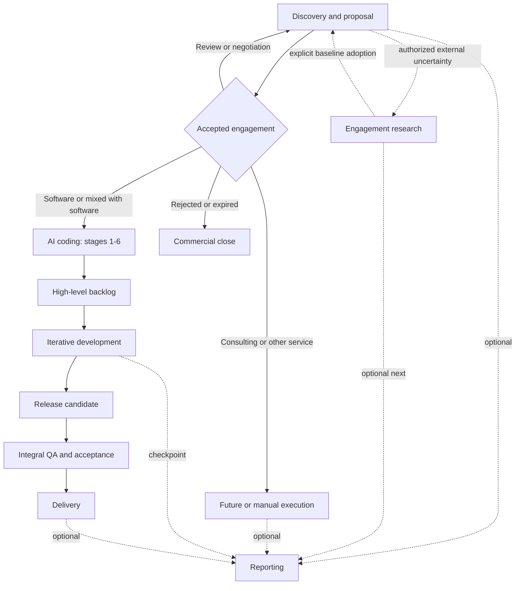
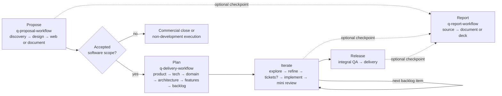

# Quasar AI delivery skills

This package coordinates project questions and proposal analysis, optional engagement research, discovery, commercial proposals, product definition, profile-driven software development, quality assurance, delivery, and optional reporting. Start with `skill-manifest.yaml`; it is the canonical registry for skill IDs, paths, routing, side effects, approval policies, and compatibility.

## Install

Install into any [Agent Skills](https://agentskills.io) client — Claude Code, Cursor, Codex, and others — with the [skills.sh](https://skills.sh) CLI:

```bash
npx skills add flaviogragnolati/ai-workflow            # choose interactively
npx skills add flaviogragnolati/ai-workflow --list     # inspect first
npx skills add flaviogragnolati/ai-workflow --skill q-code-debug --skill q-review-code
```

The installer copies one skill folder at a time into your project's agent directory, where every skill becomes a sibling of every other. Each skill is self-contained: it either bundles what it needs or declares the companion it depends on. Install the dependencies listed under [Skill dependencies](#skill-dependencies) alongside the skill that requires them; a skill whose companion is missing stops and prints the exact install command instead of proceeding on assumed rules.

Skill IDs follow `q-<group>-<leaf>`, so the catalog stays recognizable in a shared agent directory and sorts by group. `q-maint-ai-workflow`, `q-maint-writing-for-agents`, and `q-maint-skill-quality` are `distribution: internal` and are not offered to consumers; the remaining 44 are.

`skills.sh.json` groups the catalog on the skills.sh repository page. It is a derived presentation of the manifest `group` field — sections may merge groups, but the validator requires every public skill to appear in exactly one. `skill-manifest.yaml` stays the authority for what exists, what `group` it belongs to, what it `requires`, and what `distribution` it has.

## Quick start

Invoke one orchestrator and name the objective or target stage:

```text
Use $q-proposal-workflow to prepare a commercial proposal from these meeting notes.
Use $q-research-workflow to investigate this market uncertainty before deciding whether to open a proposal.
Use $q-delivery-workflow to execute q-plan-backlog.
Use $q-report-workflow to create a progress report and deck from approved project artifacts.
Use $q-maint-ai-workflow to update a workflow or related skill safely.
```

For read-only project intelligence, invoke the narrow capability directly:

```text
Use $q-ask-project to answer how this project currently handles tenant isolation.
Use $q-ask-analyze to evaluate whether moving background jobs to a managed queue fits this project.
Use $q-review-skill to audit an Agent Skill without changing it.
```

Do not invoke an orchestrator and a stage as two independent writers. The orchestrator treats the named stage as `target_stage`, delegates domain work, validates the returned delta, and remains the only writer of workflow state and artifact index.

Invoke a stage directly only when standalone output is intentional. A standalone stage writes its owned artifact, returns `reconciliation_required: true`, and does not claim global workflow completion.

## Operating model

- Registry and routing: `skill-manifest.yaml`.
- Shared governance: `skills/core/q-core-contract/SKILL.md` (the `q-core-contract` companion).
- Human-interaction cadence: [generated mapping](skills/core/q-core-contract/references/human-interaction.md); the manifest owns each mode mapping and `approval_policy` still owns mandatory approvals.
- Stage procedure: the selected `SKILL.md`.
- Internal agent-writing discipline: `skills/maint/q-maint-writing-for-agents/SKILL.md`.
- Runtime truth: project `00-workflow-state.yaml` and `00-artifact-index.yaml`.
- Explanatory views: this guide and its diagrams.

Technical development is stack-agnostic and profile-driven. Skills marked `stack_profile: project-defined` load the project's versioned technical foundation and repository evidence; skills marked `any` do not depend on a selected stack. `t3-core` remains a legacy project value during migration, not a package compatibility gate. Missing technology-specific evidence produces an explicit coverage gap rather than a false approval.

## Main workflows



Feedback and change control: any gate may return work to its owning stage. A delegated reporting run resumes at its supplied return target. Record the return in workflow state, a decision/risk register, or a change request. The diagram omits individual loops for readability.

### Quick skill guide by workflow step

Use this section as a routing aid, not as a second registry. `skill-manifest.yaml` remains authoritative for skill status, ownership, execution modes, side effects, and dependencies. Start or resume an end-to-end flow with its orchestrator; invoke a stage directly only when standalone output is intentional.



| Workflow step | Primary skill or choice | Use it when |
|---|---|---|
| Answer a project question | `q-ask-project` | Resolving a bounded factual or explanatory question from project documentation, workflow state, decisions, and observable implementation. |
| Analyze a proposal | `q-ask-analyze` | Evaluating an idea or change across project fit, benefits, downsides, risks, problems, compatibility, alternatives, and evidence before choosing deeper work. |
| Route engagement research | `q-research-workflow` | Reducing a bounded market, competitor, regulatory, technology, feasibility, or risk uncertainty into an approved snapshot without automatically opening Proposal. |
| Research 1 — scope | `q-research-scope` | Defining stable decision-linked questions, boundaries, privacy limits, search strategies, and a time or cost budget before investigation. |
| Research 2 — investigate | `q-research-investigate` | Building a cited Findings Register with source identity, claim fit, independence, contradictions, and honest search coverage. |
| Research 3 — synthesize | `q-research-synthesize` | Answering approved questions through stable finding refs, themes, debates, gaps, and a counter-evidence check. |
| Route discovery and proposal | `q-proposal-workflow` | Starting, resuming, or reconciling the commercial flow; name a target stage when only one stage is needed. |
| Proposal 1 — discover | `q-proposal-discovery` | Turning client evidence into a traceable brief, open questions, risks, and proposal-readiness assessment. |
| Proposal 2 — design | `q-proposal-design` | Defining canonical scope, solution, deliverables, schedule, investment, terms, and commitments. |
| Proposal 3 — web channel (optional) | `q-proposal-web` | Rendering an interactive proposal from approved commercial meaning; publication remains a separate approval. |
| Proposal 4 — document channel (optional) | `q-proposal-document` | Generating, visually validating, reconciling, and releasing proposal DOCX/PDF files without changing commercial meaning. |
| Route planning through delivery | `q-delivery-workflow` | Starting or resuming product planning, selecting a backlog item, coordinating the development loop, integral QA, delivery, or state recovery. |
| Planning 1 — product core | `q-plan-product-core` | Establishing product intent, actors, journeys, requirements, rules, scope, exclusions, and pending decisions. |
| Planning 2 — technical foundation | `q-plan-tech-foundation` | Selecting or reconciling stack, concrete versions, NFRs, security, testing, deployment, and operations. Return here when later evidence invalidates a technical choice. |
| Planning 3 — domain and data | `q-plan-domain-model` | Defining domain concepts, relationships, ownership, lifecycles, invariants, retention, and the supporting ERD. |
| Planning 4 — architecture | `q-plan-architecture` | Defining system architecture, ADRs, application standards, boundaries, and supporting diagrams. |
| Planning 5 — modules and features | `q-plan-features` | Decomposing architecture into modules, vertical slices, behaviors, dependencies, and technical sequence. |
| Planning 6 — backlog | `q-plan-backlog` | Creating the first high-level rolling-wave backlog, refining the next front, or synchronizing an approved replan. |
| Orient before changing code | `q-code-explore` for evidence-grounded orientation; `q-code-zoom-out` for one abstraction level above the current code | Context is missing before planning, implementation, review, or explanation. Skip this step when the needed context is already available. |
| Refine selected work | Choose one: `q-code-grill-simple`, `q-code-grill-feature`, or `q-code-grill-design`; use `q-code-implementation-plan` when direction is settled but file-level execution still needs planning | Match the depth to a small change, bounded feature, or cross-cutting architectural change. Skip refinement when the durable work item is already execution-ready. |
| Distribute work | `q-code-tickets` | Multiple executors, sessions, or a tracker justify durable tickets. It is optional for a single executor. |
| Implement and verify | `q-code-implement`; optionally `q-code-tdd` | Executing a ready backlog item, issue, ticket, or plan. Select TDD only when requested or explicitly chosen; proportional verification is always required. |
| Handle implementation trouble | `q-code-fix` for a confirmed narrow correction; `q-code-debug` when the cause is unknown; `q-code-merge-conflicts` for an active merge or rebase conflict | The main implementation path encounters a defect or source-control conflict. |
| Mini review of one change | `q-review-code` plus `q-review-comments` | Checking technical/specification conformance and the accuracy of affected comments or docstrings after implementation. These skills report findings rather than silently fixing them. |
| Integral QA and delivery | `q-review-codebase` supplies the formal codebase audit; `q-delivery-workflow` reconciles all release evidence and owns delivery | A release candidate is ready for architecture, integration, critical-flow, security, NFR, migration, deployment, documentation, and acceptance checks. The audit alone is not release acceptance. |
| Audit an Agent Skill | `q-review-skill` | Evaluating activation, authority, context value, progressive disclosure, freedom calibration, safety, verification, packaging, provenance, and behavior without editing the target or treating a numeric grade as approval. |
| Route a report | `q-report-workflow` | Producing a progress, feature, milestone, release, completion, consulting, executive, or custom report from approved artifact versions. |
| Define report meaning | `q-report-source` | Synthesizing the approved source bundle into one traceable reporting narrative before rendering. |
| Render report channels | `q-report-document` for Markdown/DOCX/PDF; `q-report-deck` for PPTX/deck PDF | Rendering the same baselined report-source version into the requested written or presentation channels. |

Use supporting skills only when their trigger appears: `q-code-research` for a bounded technical Findings Register from versioned primary evidence, `q-code-prototype` for a throwaway experiment, `q-code-explain` when the immediately preceding technical explanation needs a clearer bridge, and `q-code-handoff` when pausing or transferring work. Use `q-review-docs` for optional read-only QA of durable project documentation before a risky baseline or release, after upstream change, or when documentation health is in question. Use `q-review-skill` for a read-only diagnostic of an Agent Skill or an explicitly bounded package slice.

Three companions are not user entry points: coordinated workflows and the project-question skills load `q-core-contract` for shared governance; package maintenance loads the internal `q-maint-writing-for-agents` when agent-consumed artifacts change and `q-maint-skill-quality` when skills or invocation metadata are created, materially changed, or audited. Use `q-maint-ai-workflow` outside project runtime whenever this package, its skills, routing, contracts, metadata, fixtures, validators, or explanatory documentation must be changed or audited.

### Project questions and proposal analysis

`q-ask-project` answers one bounded question by reconciling the smallest relevant slice of project documentation, workflow state, decisions, and observable implementation. `q-ask-analyze` extends that path with a multidimensional proposal assessment and a conditional compatibility disposition. Both run a short alignment only when ambiguity could change the evidence or conclusion, return transient conversation output, and never create artifacts or mutate project state.

The analysis skill may recommend deeper research, the applicable planning owner, or a grill at the matching depth. That recommendation is a next route, not authorization to start planning or implementation.

### Discovery and proposal

1. `q-proposal-discovery` creates a traceable discovery brief and readiness assessment.
2. `q-proposal-design` owns solution, scope, engagement model, commitments, and canonical proposal source.
3. `q-proposal-web` owns the web channel and regenerates from canonical commercial meaning.
4. `q-proposal-document` owns DOCX/PDF mapping, generation, reconciliation, and visual QA.

Accepted software work may continue to AI coding. Consulting, assessment, training, managed service, and other non-development engagements may close commercially, continue through a future/manual execution path, or optionally produce reporting.

### Engagement research

`q-research-workflow` coordinates optional consulting or engagement research that reduces a named external uncertainty. It may run as a root workflow or be delegated by Proposal when Discovery cannot responsibly resolve a material market, competitor, regulatory, technology, feasibility, or risk question from client evidence.

1. `q-research-scope` creates an authorized Research Brief with stable questions, decision links, boundaries, search strategies, privacy limits, budget, and stopping conditions.
2. `q-research-investigate` creates the Findings Register. Source verification, claim status, and search coverage remain separate; source provenance and claim fit are independent axes.
3. `q-research-synthesize` answers by finding ID, preserves debates and gaps, and runs a counter-evidence check without copying source or claim records.
4. `q-research-workflow` baselines the exact approved brief, findings, and synthesis versions at an `as_of` date.

The Research Baseline is canonical only for the approved snapshot. Its claims and synthesis remain supporting evidence. A directly invoked root run may close without Proposal; starting Proposal or Reporting requires an explicit choice. A Proposal-delegated run is adopted as `external-research`, retained independently, or deferred through an explicit disposition, and Research never edits the Discovery Brief.

`q-code-research` remains a separate technical capability for official documentation, specifications, source code, APIs, compatibility, and versioned behavior during planning or delivery. It shares the cited-findings contract but not the engagement workflow or synthesis procedure.

### AI coding and delivery

Planning stages:

1. `q-plan-product-core`
2. `q-plan-tech-foundation`
3. `q-plan-domain-model`
4. `q-plan-architecture`
5. `q-plan-features`
6. `q-plan-backlog`

Stage 6 produces the first complete high-level backlog: milestones, epics, known features or workstreams, checkpoints, dependencies, readiness, and a next selectable front. It does not require exhaustive tasks or tickets.

`q-plan-tech-foundation` owns `02-technical-foundation.md`, the canonical project profile for stack selection, concrete versions, NFR and operational fit, adopted recommendations, pitfalls, antipatterns, and version-scoped external references. Workflow state carries its exact artifact ID and version as `technical_foundation_ref`. Later stages report contradictions and route reconciliation to the owner instead of editing the profile.

For a suitable greenfield web application without a mandated stack, the workflow recommends T3 Core—TypeScript, Next.js App Router, and tRPC—as an advisory starting point. It evaluates Zod, Zustand, shadcn/ui, React Hook Form, and one of Drizzle or Prisma as secondary candidates only when their applicability conditions hold. Existing codebases, user proposals, other product shapes, and NFRs may lead to another stack; the user confirms every material selection.

Development selects a high-level item, refines only as needed, optionally creates durable tickets, implements, verifies, performs a mini technical and comment review, then prepares a release candidate for separate integral QA and delivery.

### Reporting

`q-report-workflow` coordinates optional progress, feature, milestone, release, completion, consulting, executive, and custom reporting from explicit artifact IDs and versions produced by prior workflows. It delegates semantic synthesis to `q-report-source`, then renders the approved source through `q-report-document` for Markdown, DOCX, and PDF, `q-report-deck` for PPTX and PDF, or both sequentially.

The report source is canonical only for reporting narrative and approved interpretation. Upstream artifacts retain authority over their facts and commitments; every rendered channel is derived with no semantic authority. A report may use an explicitly approved snapshot of in-progress work, but must show its reporting period and `as_of` and must not imply upstream completion.

When discovery or AI coding delegates reporting, the calling workflow remains root orchestrator and global state writer. Reporting returns a composite delta and resumes at the supplied return target. When reporting is invoked directly for the project, `q-report-workflow` is the root orchestrator. Release approval remains separate from publication or external sending.

### Documentation QA

`q-review-docs` optionally audits active durable project documentation for structural breakage, authority and lifecycle errors, traceability gaps, contradictions, and drift from authoritative sources or observable implementation. It returns a transient diagnostic in the conversation and never edits documents, creates an audit artifact, or writes workflow state or the artifact index. A separately approved remediation returns to the owning skill and is recorded in the applicable workflow changelog, change-control record, or authoritative version history.

Use `q-maint-ai-workflow`, not `q-review-docs`, for documentation owned by this package.

### Agent Skill QA

`q-review-skill` audits one Agent Skill, a comparison, or an explicitly bounded package slice without changing it. It combines deterministic structure checks with evidence-based review of activation, authority, context value, procedure, disclosure, safety, completion, packaging, provenance, and realistic trigger behavior. A requested numeric score is reported only as a disclosed heuristic; it never overrides a blocker or becomes package acceptance.

For this repository, remediation and final acceptance remain package maintenance responsibilities. `q-maint-skill-quality` is the internal companion that applies the public diagnostic together with the manifest, package validator, official `quick_validate.py`, trigger tests, derived-view synchronization, and the maintenance philosophy gate.

### Package maintenance

`q-maint-ai-workflow` is the administrative entry point for adding, removing, renaming, reorganizing, auditing, or changing workflows, skills, governance, routing, metadata, schemas, fixtures, and validators. It builds an impact map, checks the proposal against package philosophy and anti-patterns, synchronizes connected surfaces, and runs structural and behavioral validation.

Maintenance is outside project runtime. It does not write project workflow state, update the project artifact index, return a project stage result, or participate in client delivery execution.

`q-maint-writing-for-agents` is an internal companion used by repository agents and owning skills when they create or materially edit agent-consumed artifacts. `q-maint-skill-quality` is an internal acceptance companion for skill and invocation-metadata changes; it reuses `q-review-skill` rather than duplicating its evidence lenses. Both are registered with `invocable: false`, have no user-facing skill interface, inherit the owning task's authority, and create no independently authoritative project output.

## Skill dependencies

`invocable` and `distribution` are independent. `invocable: false` means a skill is a companion rather than a user entry point; `distribution: internal` means it is not offered to consumers. `q-core-contract` is a **public companion**: never invoked directly, always shipped to anyone installing a coordinated workflow skill.

`requires` in the manifest lists what a skill cannot work without. Install these together:

| Skill | Requires | Why |
|---|---|---|
| The 21 coordinated workflow skills — every `q-proposal-*`, `q-plan-*`, `q-research-*`, `q-report-*`, plus `q-delivery-workflow` and `q-review-docs` | `q-core-contract` | Shared governance, the routing digest, and the cited-findings, report-source, and stage-result schemas |
| `q-ask-project` | `q-core-contract` | Reconciles project state, artifact authority, lifecycle, and observable implementation before answering |
| `q-ask-analyze` | `q-core-contract`, `q-ask-project` | Reuses the same alignment and evidence path before applying proposal-analysis lenses |
| `q-code-research` | `q-core-contract` | Uses the shared cited-findings evidence contract while retaining technical-domain procedure |
| `q-report-document` | `q-core-contract`, `q-report-deck` | Also reads the Quasar presentation identity bundled in the deck skill |
| `q-code-explore` | `q-code-grill-design` | Reads its deep-module glossary when modules, interfaces, or seams matter |

Every other public skill has no required companion. Two reference forms survive installation: a one-level `../<sibling-skill>/…` path, and a companion named in prose. Anything deeper than one level leaves the installed catalog and fails validation.

The internal `q-maint-skill-quality` companion requires `q-review-skill` and `q-maint-writing-for-agents` inside the maintenance package. Consumers do not install this internal acceptance route.

## Artifact lifecycle

| Record | Durable? | Authority |
|---|---:|---|
| Workflow state and artifact index | Yes | Canonical for runtime coordination |
| Technical foundation | Yes | Canonical for selected stack, versioned technology guidance, NFR and operational fit |
| Stage domain artifact | Yes | Declared per artifact |
| Backlog and ticket | Yes | Canonical for their execution scope |
| Implementer's scratchpad or internal delegation | No | None |
| Domain/architecture Mermaid source | Yes | Supporting; canonical only for the visual representation |
| Rendered SVG/PNG/PDF | Yes when delivered | None; derived from its source |
| Baselined report source | Yes | Canonical only for reporting selection, narrative, and approved interpretation |
| Report Markdown/DOCX/PDF or deck PPTX/PDF | Yes when delivered | None; derived from the baselined report source |
| Research Brief | Yes | Canonical only for the approved research scope, boundaries, and budget |
| Findings Register and Research Synthesis | Yes | Supporting for cited findings, observed coverage, and cross-finding interpretation |
| Research Baseline | Yes | Canonical only for exact approved research artifact versions and `as_of` |
| Release candidate, integral validation, delivery manifest | Yes | Canonical for release/delivery scope |

Use `Working`, `Baselined`, `Released`, `Superseded`, `Archived`, or `Transient` as defined in the shared contract.

## Recommended routing

| Need | Entry skill |
|---|---|
| Answer a bounded question from project truth | `q-ask-project` |
| Evaluate whether a proposal fits the project | `q-ask-analyze` |
| Reduce an external engagement uncertainty | `q-research-workflow` |
| Research a bounded technical claim | `q-code-research` |
| Start or resume a proposal | `q-proposal-workflow` |
| Start or resume product planning or delivery | `q-delivery-workflow` |
| Orient around a codebase, feature, module, or document | `q-code-explore` |
| Deep architecture alignment | `q-code-grill-design` |
| Feature alignment and plan | `q-code-grill-feature` |
| Small scoped plan | `q-code-grill-simple` |
| Convert settled work to distributed tickets | `q-code-tickets` |
| Execute a plan, ticket, or ready backlog item | `q-code-implement` |
| Review one change | `q-review-code` plus `q-review-comments` |
| Audit a codebase or release candidate | `q-review-codebase` |
| Audit durable project documentation | `q-review-docs` |
| Audit an Agent Skill or bounded skill-package slice | `q-review-skill` |
| Produce a traced project report or report deck | `q-report-workflow` |
| Render an approved report source as Markdown, DOCX, and PDF | `q-report-document` |
| Produce a standalone Quasar presentation | `q-report-deck` |
| Change or audit the workflow package | `q-maint-ai-workflow` |

Groups sort the catalog and name the skills: `ask`, `proposal`, `research`, `delivery`, `plan`, `code`, `review`, `report`, `core`, and `maint`. The manifest `group` field is authoritative — the skill name, its folder, its category folder, and the skills.sh sections all derive from it.

## Anti-patterns

- Do not load every skill before choosing a route.
- Do not force an alignment mini-grill when the question or proposal is already clear, or investigate broadly while a material interpretation remains unresolved.
- Do not let a stage write global state or artifact index.
- Do not make tickets or TDD mandatory by default.
- Do not use an internal implementation scratchpad as a durable project plan.
- Do not treat a visual render as semantic authority.
- Do not rewrite accepted commercial scope from a channel renderer.
- Do not treat the preferred T3 web recommendation as a mandatory stack or flag unselected secondary libraries as missing.
- Do not issue stack-specific QA approval from generic criteria or stale technology guidance.
- Do not let a documentation audit rewrite its targets or create a parallel changelog.
- Do not treat a universal numeric skill grade, line-count target, or pattern taxonomy as package acceptance without target authority and behavioral evidence.
- Do not let a report renderer own report meaning or treat a rendered channel as upstream truth.
- Do not let Research overwrite client evidence, create a proposal commitment, or start another workflow without an explicit choice.
- Do not treat verified source identity, claim support, and completed search coverage as the same state.
- Do not let a delegated reporting subworkflow write global state or the artifact index.
- Do not create empty folders for planned capabilities.
- Do not commit or publish through a read-only or unapproved execution mode.
- Do not embed package housekeeping in a client or project workflow run.

## Expected result

A completed workflow stage leaves owned artifacts, traceable IDs, declared authority and lifecycle, a valid `stage_result`, reconciled runtime state when orchestrated, explicit blockers when incomplete, and one clear next action. A read-only shared tool such as `q-ask-project`, `q-ask-analyze`, `q-code-explore`, or `q-review-docs` returns only its declared transient output and does not claim stage completion.

## Planned capabilities

No capabilities are currently registered as planned.

Run `python3 skills/scripts/validate-skills-package.py` after any package change.
