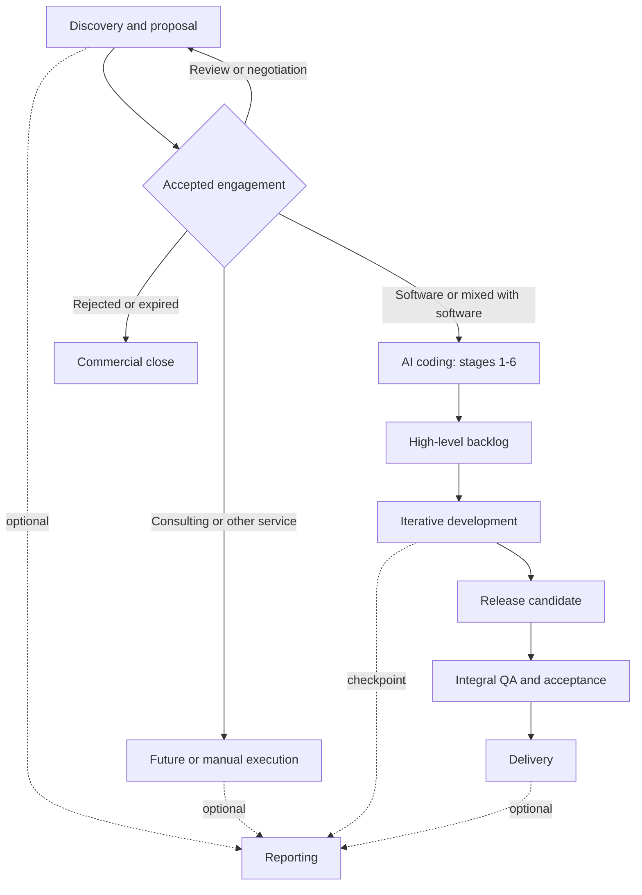

# Quasar AI delivery skills

This package coordinates discovery, commercial proposals, product definition, profile-driven software development, quality assurance, delivery, and optional reporting. Start with `skill-manifest.yaml`; it is the canonical registry for skill IDs, paths, routing, side effects, approval policies, and compatibility.

## Install

Install into any [Agent Skills](https://agentskills.io) client — Claude Code, Cursor, Codex, and others — with the [skills.sh](https://skills.sh) CLI:

```bash
npx skills add flaviogragnolati/ai-workflow            # choose interactively
npx skills add flaviogragnolati/ai-workflow --list     # inspect first
npx skills add flaviogragnolati/ai-workflow --skill q-code-debug --skill q-review-code
```

The installer copies one skill folder at a time into your project's agent directory, where every skill becomes a sibling of every other. Each skill is self-contained: it either bundles what it needs or declares the companion it depends on. Install the dependencies listed under [Skill dependencies](#skill-dependencies) alongside the skill that requires them; a skill whose companion is missing stops and prints the exact install command instead of proceeding on assumed rules.

Skill IDs follow `q-<group>-<leaf>`, so the catalog stays recognizable in a shared agent directory and sorts by group. `q-maint-ai-workflow` and `q-maint-writing-for-agents` are `distribution: internal` and are not offered to consumers; the remaining 37 are.

`skills.sh.json` groups the catalog on the skills.sh repository page. It is a derived presentation of the manifest `group` field — sections may merge groups, but the validator requires every public skill to appear in exactly one. `skill-manifest.yaml` stays the authority for what exists, what `group` it belongs to, what it `requires`, and what `distribution` it has.

## Quick start

Invoke one orchestrator and name the objective or target stage:

```text
Use $q-proposal-workflow to prepare a commercial proposal from these meeting notes.
Use $q-delivery-workflow to execute q-plan-backlog.
Use $q-report-workflow to create a progress report and deck from approved project artifacts.
Use $q-maint-ai-workflow to update a workflow or related skill safely.
```

Do not invoke an orchestrator and a stage as two independent writers. The orchestrator treats the named stage as `target_stage`, delegates domain work, validates the returned delta, and remains the only writer of workflow state and artifact index.

Invoke a stage directly only when standalone output is intentional. A standalone stage writes its owned artifact, returns `reconciliation_required: true`, and does not claim global workflow completion.

## Operating model

- Registry and routing: `skill-manifest.yaml`.
- Shared governance: `skills/core/q-core-contract/SKILL.md` (the `q-core-contract` companion).
- Stage procedure: the selected `SKILL.md`.
- Internal agent-writing discipline: `skills/maint/q-maint-writing-for-agents/SKILL.md`.
- Runtime truth: project `00-workflow-state.yaml` and `00-artifact-index.yaml`.
- Explanatory views: this guide and its diagrams.

Technical development is stack-agnostic and profile-driven. Skills marked `stack_profile: project-defined` load the project's versioned technical foundation and repository evidence; skills marked `any` do not depend on a selected stack. `t3-core` remains a legacy project value during migration, not a package compatibility gate. Missing technology-specific evidence produces an explicit coverage gap rather than a false approval.

## Main workflows



Feedback and change control: any gate may return work to its owning stage. A delegated reporting run resumes at its supplied return target. Record the return in workflow state, a decision/risk register, or a change request. The diagram omits individual loops for readability.

### Discovery and proposal

1. `q-proposal-discovery` creates a traceable discovery brief and readiness assessment.
2. `q-proposal-design` owns solution, scope, engagement model, commitments, and canonical proposal source.
3. `q-proposal-web` owns the web channel and regenerates from canonical commercial meaning.
4. `q-proposal-document` owns DOCX/PDF mapping, generation, reconciliation, and visual QA.

Accepted software work may continue to AI coding. Consulting, assessment, training, managed service, and other non-development engagements may close commercially, continue through a future/manual execution path, or optionally produce reporting.

### AI coding and delivery

Planning stages:

1. `q-plan-product-core`
2. `q-plan-tech-foundation`
3. `q-plan-domain-model`
4. `q-plan-architecture`
5. `q-plan-features`
6. `q-plan-backlog`

Stage 6 produces the first complete high-level backlog: milestones, epics, known features or workstreams, checkpoints, dependencies, readiness, and a next selectable front. It does not require exhaustive tasks or tickets.

`q-plan-tech-foundation` owns `02-technical-foundation.md`, the canonical project profile for stack selection, concrete versions, NFR and operational fit, adopted recommendations, pitfalls, antipatterns, and version-scoped external references. Workflow state carries its exact artifact ID and version as `technical_foundation_ref`. Later stages report contradictions and route reconciliation to the owner instead of editing the profile.

For a suitable greenfield web application without a mandated stack, the workflow recommends T3 Core—TypeScript, Next.js App Router, and tRPC—as an advisory starting point. It evaluates Zod, Zustand, shadcn/ui, React Hook Form, and one of Drizzle or Prisma as secondary candidates only when their applicability conditions hold. Existing codebases, user proposals, other product shapes, and NFRs may lead to another stack; the user confirms every material selection.

Development selects a high-level item, refines only as needed, optionally creates durable tickets, implements, verifies, performs a mini technical and comment review, then prepares a release candidate for separate integral QA and delivery.

### Reporting

`q-report-workflow` coordinates optional progress, feature, milestone, release, completion, consulting, executive, and custom reporting from explicit artifact IDs and versions produced by prior workflows. It delegates semantic synthesis to `q-report-source`, then renders the approved source through `q-report-document` for Markdown, DOCX, and PDF, `q-report-deck` for PPTX and PDF, or both sequentially.

The report source is canonical only for reporting narrative and approved interpretation. Upstream artifacts retain authority over their facts and commitments; every rendered channel is derived with no semantic authority. A report may use an explicitly approved snapshot of in-progress work, but must show its reporting period and `as_of` and must not imply upstream completion.

When discovery or AI coding delegates reporting, the calling workflow remains root orchestrator and global state writer. Reporting returns a composite delta and resumes at the supplied return target. When reporting is invoked directly for the project, `q-report-workflow` is the root orchestrator. Release approval remains separate from publication or external sending.

### Documentation QA

`q-review-docs` optionally audits active durable project documentation for structural breakage, authority and lifecycle errors, traceability gaps, contradictions, and drift from authoritative sources or observable implementation. It returns a transient diagnostic in the conversation and never edits documents, creates an audit artifact, or writes workflow state or the artifact index. A separately approved remediation returns to the owning skill and is recorded in the applicable workflow changelog, change-control record, or authoritative version history.

Use `q-maint-ai-workflow`, not `q-review-docs`, for documentation owned by this package.

### Package maintenance

`q-maint-ai-workflow` is the administrative entry point for adding, removing, renaming, reorganizing, auditing, or changing workflows, skills, governance, routing, metadata, schemas, fixtures, and validators. It builds an impact map, checks the proposal against package philosophy and anti-patterns, synchronizes connected surfaces, and runs structural and behavioral validation.

Maintenance is outside project runtime. It does not write project workflow state, update the project artifact index, return a project stage result, or participate in client delivery execution.

`q-maint-writing-for-agents` is an internal companion used by repository agents and owning skills when they create or materially edit agent-consumed artifacts. It is registered with `invocable: false`, has no user-facing skill interface, inherits the owning task's authority, and creates no independently authoritative project output.

## Skill dependencies

`invocable` and `distribution` are independent. `invocable: false` means a skill is a companion rather than a user entry point; `distribution: internal` means it is not offered to consumers. `q-core-contract` is a **public companion**: never invoked directly, always shipped to anyone installing a coordinated workflow skill.

`requires` in the manifest lists what a skill cannot work without. Install these together:

| Skill | Requires | Why |
|---|---|---|
| The 17 coordinated workflow skills — every `q-proposal-*`, `q-plan-*`, `q-report-*`, plus `q-delivery-workflow` and `q-review-docs` | `q-core-contract` | Shared governance, the routing digest, and the `report-source` and `stage-result` schemas |
| `q-report-document` | `q-core-contract`, `q-report-deck` | Also reads the Quasar presentation identity bundled in the deck skill |
| `q-code-explore` | `q-code-grill-design` | Reads its deep-module glossary when modules, interfaces, or seams matter |

Every other public skill is standalone. Two reference forms survive installation: a one-level `../<sibling-skill>/…` path, and a companion named in prose. Anything deeper than one level leaves the installed catalog and fails validation.

## Artifact lifecycle

| Record | Durable? | Authority |
|---|---:|---|
| Workflow state and artifact index | Yes | Canonical for runtime coordination |
| Technical foundation | Yes | Canonical for selected stack, versioned technology guidance, NFR and operational fit |
| Stage domain artifact | Yes | Declared per artifact |
| Backlog and ticket | Yes | Canonical for their execution scope |
| Implementer's scratchpad or internal delegation | No | None |
| Domain/architecture Mermaid source | Yes | Supporting; canonical only for the visual representation |
| Rendered SVG/PNG/PDF | Yes when delivered | None; derived from its source |
| Baselined report source | Yes | Canonical only for reporting selection, narrative, and approved interpretation |
| Report Markdown/DOCX/PDF or deck PPTX/PDF | Yes when delivered | None; derived from the baselined report source |
| Release candidate, integral validation, delivery manifest | Yes | Canonical for release/delivery scope |

Use `Working`, `Baselined`, `Released`, `Superseded`, `Archived`, or `Transient` as defined in the shared contract.

## Recommended routing

| Need | Entry skill |
|---|---|
| Start or resume a proposal | `q-proposal-workflow` |
| Start or resume product planning or delivery | `q-delivery-workflow` |
| Orient around a codebase, feature, module, or document | `q-code-explore` |
| Deep architecture alignment | `q-code-grill-design` |
| Feature alignment and plan | `q-code-grill-feature` |
| Small scoped plan | `q-code-grill-simple` |
| Convert settled work to distributed tickets | `q-code-tickets` |
| Execute a plan, ticket, or ready backlog item | `q-code-implement` |
| Review one change | `q-review-code` plus `q-review-comments` |
| Audit a codebase or release candidate | `q-review-codebase` |
| Audit durable project documentation | `q-review-docs` |
| Produce a traced project report or report deck | `q-report-workflow` |
| Render an approved report source as Markdown, DOCX, and PDF | `q-report-document` |
| Produce a standalone Quasar presentation | `q-report-deck` |
| Change or audit the workflow package | `q-maint-ai-workflow` |

Groups sort the catalog and name the skills: `proposal`, `delivery`, `plan`, `code`, `review`, `report`, `core`, and `maint`. The manifest `group` field is authoritative — the skill name, its folder, its category folder, and the skills.sh sections all derive from it.

## Anti-patterns

- Do not load every skill before choosing a route.
- Do not let a stage write global state or artifact index.
- Do not make tickets or TDD mandatory by default.
- Do not use an internal implementation scratchpad as a durable project plan.
- Do not treat a visual render as semantic authority.
- Do not rewrite accepted commercial scope from a channel renderer.
- Do not treat the preferred T3 web recommendation as a mandatory stack or flag unselected secondary libraries as missing.
- Do not issue stack-specific QA approval from generic criteria or stale technology guidance.
- Do not let a documentation audit rewrite its targets or create a parallel changelog.
- Do not let a report renderer own report meaning or treat a rendered channel as upstream truth.
- Do not let a delegated reporting subworkflow write global state or the artifact index.
- Do not create empty folders for planned capabilities.
- Do not commit or publish through a read-only or unapproved execution mode.
- Do not embed package housekeeping in a client or project workflow run.

## Expected result

A completed workflow stage leaves owned artifacts, traceable IDs, declared authority and lifecycle, a valid `stage_result`, reconciled runtime state when orchestrated, explicit blockers when incomplete, and one clear next action. A read-only shared tool such as `q-code-explore` or `q-review-docs` returns only its declared transient output and does not claim stage completion.

## Planned capabilities

No capabilities are currently registered as planned.

Run `python3 skills/scripts/validate-skills-package.py` after any package change.
