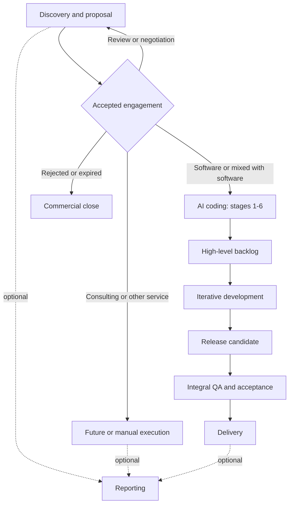

# Quasar AI delivery skills

This package coordinates discovery, commercial proposals, product definition, T3 development, quality assurance, delivery, and optional reporting. Start with `skill-manifest.yaml`; it is the canonical registry for skill IDs, paths, routing, side effects, approval policies, and compatibility.

## Quick start

Invoke one orchestrator and name the objective or target stage:

```text
Use $discovery-proposal-workflow to prepare a commercial proposal from these meeting notes.
Use $ai-coding-workflow to execute backlog-and-delivery-planning.
Use $maintain-ai-workflow to update a workflow or related skill safely.
```

Do not invoke an orchestrator and a stage as two independent writers. The orchestrator treats the named stage as `target_stage`, delegates domain work, validates the returned delta, and remains the only writer of workflow state and artifact index.

Invoke a stage directly only when standalone output is intentional. A standalone stage writes its owned artifact, returns `reconciliation_required: true`, and does not claim global workflow completion.

## Operating model

- Registry and routing: `skill-manifest.yaml`.
- Shared governance: `00-cross-workflow-contract.md`.
- Stage procedure: the selected `SKILL.md`.
- Runtime truth: project `00-workflow-state.yaml` and `00-artifact-index.yaml`.
- Explanatory views: this guide and its diagrams.

The package supports `t3-core` for development and QA. A non-T3 project must stop or use a future adapter instead of receiving a false approval.

## Main workflows



Feedback and change control: any gate may return work to its owning stage. Record the return in workflow state, a decision/risk register, or a change request. The diagram omits individual loops for readability.

### Discovery and proposal

1. `proposal-discovery` creates a traceable discovery brief and readiness assessment.
2. `commercial-proposal-design` owns solution, scope, engagement model, commitments, and canonical proposal source.
3. `interactive-web-proposal` owns the web channel and regenerates from canonical commercial meaning.
4. `commercial-proposal-document` owns DOCX/PDF mapping, generation, reconciliation, and visual QA.

Accepted software work may continue to AI coding. Consulting, assessment, training, managed service, and other non-development engagements may close commercially, continue through a future/manual execution path, or optionally produce reporting.

### AI coding and delivery

Planning stages:

1. `product-core-definition`
2. `technical-foundation-definition`
3. `domain-data-modeling`
4. `high-level-architecture-standards`
5. `module-feature-decomposition`
6. `backlog-and-delivery-planning`

Stage 6 produces the first complete high-level backlog: milestones, epics, known features or workstreams, checkpoints, dependencies, readiness, and a next selectable front. It does not require exhaustive tasks or tickets.

Development selects a high-level item, refines only as needed, optionally creates durable tickets, implements, verifies, performs a mini technical and comment review, then prepares a release candidate for separate integral QA and delivery.

### Reporting

`generate-quasar-deck` is the only active reporting capability in this version. Reporting is optional and does not change upstream acceptance criteria. `generate-report` and `reporting-workflow` are planned and non-invocable.

### Package maintenance

`maintain-ai-workflow` is the administrative entry point for adding, removing, renaming, reorganizing, auditing, or changing workflows, skills, governance, routing, metadata, schemas, fixtures, and validators. It builds an impact map, checks the proposal against package philosophy and anti-patterns, synchronizes connected surfaces, and runs structural and behavioral validation.

Maintenance is outside project runtime. It does not write project workflow state, update the project artifact index, return a project stage result, or participate in client delivery execution.

## Artifact lifecycle

| Record | Durable? | Authority |
|---|---:|---|
| Workflow state and artifact index | Yes | Canonical for runtime coordination |
| Stage domain artifact | Yes | Declared per artifact |
| Backlog and ticket | Yes | Canonical for their execution scope |
| Implementer's scratchpad or internal delegation | No | None |
| Domain/architecture Mermaid source | Yes | Supporting; canonical only for the visual representation |
| Rendered SVG/PNG/PDF | Yes when delivered | None; derived from its source |
| Release candidate, integral validation, delivery manifest | Yes | Canonical for release/delivery scope |

Use `Working`, `Baselined`, `Released`, `Superseded`, `Archived`, or `Transient` as defined in the shared contract.

## Recommended routing

| Need | Entry skill |
|---|---|
| Start or resume a proposal | `discovery-proposal-workflow` |
| Start or resume product planning or delivery | `ai-coding-workflow` |
| Deep architecture alignment | `design-grill` |
| Feature alignment and plan | `feature-grill` |
| Small scoped plan | `simple-grill` |
| Convert settled work to distributed tickets | `to-tickets` |
| Execute a plan, ticket, or ready backlog item | `implement` |
| Review one change | `code-review` plus `review-code-comments` |
| Audit a T3 codebase or release candidate | `codebase-review` |
| Produce a Quasar presentation | `generate-quasar-deck` |
| Change or audit the workflow package | `maintain-ai-workflow` |

## Anti-patterns

- Do not load every skill before choosing a route.
- Do not let a stage write global state or artifact index.
- Do not make tickets or TDD mandatory by default.
- Do not use an internal implementation scratchpad as a durable project plan.
- Do not treat a visual render as semantic authority.
- Do not rewrite accepted commercial scope from a channel renderer.
- Do not run T3 QA as if it covered another stack.
- Do not create empty folders for planned capabilities.
- Do not commit or publish through a read-only or unapproved execution mode.
- Do not embed package housekeeping in a client or project workflow run.

## Expected result

A completed run leaves owned artifacts, traceable IDs, declared authority and lifecycle, a valid `stage_result`, reconciled runtime state when orchestrated, explicit blockers when incomplete, and one clear next action.

## Planned capabilities

These IDs are registered but cannot be invoked:

- `cleanup-docs`
- `explore`
- `generate-report`
- `reporting-workflow`

Run `scripts/validate-skills-package.py` after any package change.
