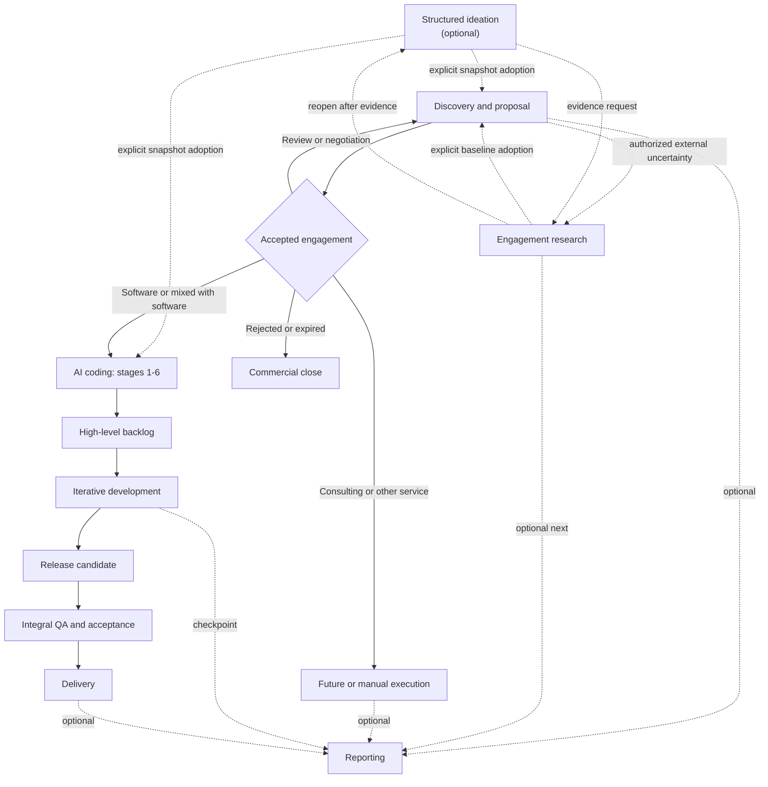
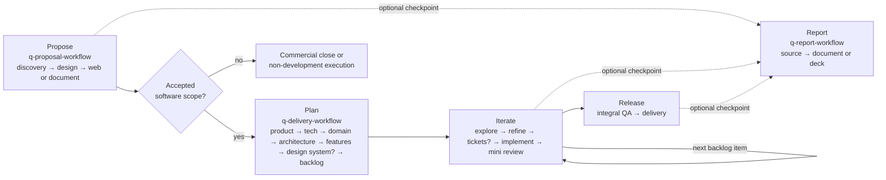

# Quasar AI delivery skills

This package coordinates project questions and proposal analysis, optional structured ideation, optional general or market engagement research, read-only evidence review, discovery, commercial proposals, product definition, profile-driven software development, quality assurance, delivery, optional reporting, and shared bilingual prose-editing, database-schema, C4 architecture, structural-diagram, and runtime-neutral PDF tooling. Start with `skill-manifest.yaml`; it is the canonical registry for skill IDs, paths, routing, side effects, approval policies, and compatibility.

## Install

Install into any [Agent Skills](https://agentskills.io) client — Claude Code, Cursor, Codex, and others — with the [skills.sh](https://skills.sh) CLI:

```bash
npx skills add flaviogragnolati/ai-workflow            # choose interactively
npx skills add flaviogragnolati/ai-workflow --list     # inspect first
npx skills add flaviogragnolati/ai-workflow --skill q-code-debug --skill q-review-code
```

The installer copies one skill folder at a time into your project's agent directory, where every skill becomes a sibling of every other. Each skill is operationally self-contained: it either bundles what it needs or declares the companion it depends on. Install the dependencies listed under [Skill dependencies](#skill-dependencies) alongside the skill that requires them; a skill whose companion is missing stops and prints the exact install command instead of proceeding on assumed rules.

[`LICENSE`](LICENSE) at the repository root is the sole package license and third-party attribution catalog. It lists the external repositories used as references, the affected Quasar skills, source revisions, adaptation scope, and applicable terms. Skill directories do not duplicate that catalog, so an isolated skill installation does not contain a local copy; licenses belonging to bundled third-party dependencies remain with those dependencies.

This package remains prerelease. `CHANGELOG.md` records work under `Unreleased`; no stable package version or release tag is established by the current repository state.

Skill IDs follow `q-<group>-<leaf>`, so the catalog stays recognizable in a shared agent directory and sorts by group. `q-maint-ai-workflow`, `q-maint-writing-for-agents`, and `q-maint-skill-quality` are `distribution: internal` and are not offered to consumers; the remaining 53 are.

`skills.sh.json` groups the catalog on the skills.sh repository page. It is a derived presentation of the manifest `group` field — sections may merge groups, but the validator requires every public skill to appear in exactly one. `skill-manifest.yaml` stays the authority for what exists, what `group` it belongs to, what it `requires` or optionally `uses`, and what `distribution` it has.

## Quick start

Invoke one orchestrator and name the objective or target stage:

```text
Use $q-proposal-workflow to prepare a commercial proposal from these meeting notes.
Use $q-research-workflow to investigate this market uncertainty before deciding whether to open a proposal.
Use $q-research-workflow to run a market-profile brief through evidence, auditable sizing, synthesis, and baseline.
Use $q-delivery-workflow to execute q-plan-backlog.
Use $q-report-workflow to create a progress report and deck from approved project artifacts.
Use $q-maint-ai-workflow to update a workflow or related skill safely.
```

For read-only project intelligence, invoke the narrow capability directly:

```text
Use $q-ask-project to answer how this project currently handles tenant isolation.
Use $q-ask-analyze to evaluate whether moving background jobs to a managed queue fits this project.
Use $q-review-evidence to audit this vendor benchmark and its supplied methodology without changing either.
Use $q-review-skill to audit an Agent Skill without changing it.
Use $q-ideation-session to explore options for this decision before Discovery, Product Core, or Proposal Design.
Use $q-ideation-session to discover improvement opportunities in an existing product before deciding what to build next.
```

Invoke a shared tool directly for bounded prose editing, database analysis, PDF operations, or an editable architecture or structural diagram:

```text
Use $q-tool-database-schema to review this PostgreSQL migration from the supplied schema and rollout constraints without executing it.
Use $q-tool-c4 to map the components inside the confirmed Checkout API container from repository evidence and render a C4 SVG with an available local backend.
Use $q-tool-mermaid to create a sequence diagram for this authentication flow and save the source and SVG.
Use $q-tool-humanizer to detect AI-writing patterns in this Spanish proposal, rewrite it naturally, or make it clearer without changing facts.
Use $q-tool-pdf to inspect, transform, fill, or validate this PDF with the available Python or Node backend.
```

Do not invoke an orchestrator and a stage as two independent writers. The orchestrator treats the named stage as `target_stage`, delegates domain work, validates the returned delta, and remains the only writer of workflow state and artifact index.

Invoke a stage directly only when standalone output is intentional. A standalone stage writes its owned artifact, returns `reconciliation_required: true`, and does not claim global workflow completion.

## Operating model

- Registry and routing: `skill-manifest.yaml`.
- Shared governance: `skills/core/q-core-contract/SKILL.md` (the `q-core-contract` companion).
- Human-interaction cadence: [generated mapping](skills/core/q-core-contract/references/human-interaction.md); the manifest owns each mode mapping and `approval_policy` still owns mandatory approvals.
- Stage procedure: the selected `SKILL.md`.
- Internal agent-writing discipline: `skills/maint/q-maint-writing-for-agents/SKILL.md`.
- Runtime truth: project `00-workflow-state.yaml` and `00-artifact-index.yaml`.
- Explanatory views: this guide and its diagrams.

Technical development is stack-agnostic and profile-driven. Skills marked `stack_profile: project-defined` load the project's versioned technical foundation and repository evidence; skills marked `any` do not depend on a selected stack. `t3-core` remains a legacy project value during migration, not a package compatibility gate. Missing technology-specific evidence produces an explicit coverage gap rather than a false approval.

## Main workflows



Feedback and change control: any gate may return work to its owning stage. A delegated reporting run resumes at its supplied return target. Record the return in workflow state, a decision/risk register, or a change request. The diagram omits individual loops for readability.

### Quick skill guide by workflow step

Use this section as a routing aid, not as a second registry. `skill-manifest.yaml` remains authoritative for skill status, ownership, execution modes, side effects, and dependencies. Start or resume an end-to-end flow with its orchestrator; invoke a stage directly only when standalone output is intentional.



| Workflow step | Primary skill or choice | Use it when |
|---|---|---|
| Answer a project question | `q-ask-project` | Resolving a bounded factual or explanatory question from project documentation, workflow state, decisions, and observable implementation. |
| Analyze a proposal | `q-ask-analyze` | Evaluating an idea or change across project fit, benefits, downsides, risks, problems, compatibility, alternatives, and evidence before choosing deeper work. |
| Explore options for a decision | `q-ideation-session` | Generating, comparing, gating, and disposing candidate problem frames, opportunities, solutions, interventions, or research directions before an owning stage commits to one, including an improvement-opportunity sweep over an existing product or service. |
| Route engagement research | `q-research-workflow` | Reducing a bounded market, competitor, regulatory, technology, feasibility, or risk uncertainty into an approved snapshot without automatically opening Proposal. |
| Research 1 — scope | `q-research-scope` | Defining stable decision-linked questions, boundaries, privacy limits, search strategies, and a time or cost budget before investigation. |
| Research 2 — investigate | `q-research-investigate` | Building a cited Findings Register with source identity, claim fit, independence, contradictions, and honest search coverage. |
| Research 3 — market analysis (conditional) | `q-research-market-analysis` | Normalizing measurement and producing evidence-linked sizing, TAM/SAM/SOM, reconciliation, forecasts, sensitivity, competitor matrices, shares, CRn, HHI, and scenarios from exact brief and findings versions. |
| Research 4 — synthesize | `q-research-synthesize` | Answering approved questions through stable finding and optional published-result refs, themes, debates, gaps, and a counter-evidence check. |
| Route discovery and proposal | `q-proposal-workflow` | Starting, resuming, or reconciling the commercial flow; name a target stage when only one stage is needed. |
| Proposal 1 — discover | `q-proposal-discovery` | Turning client evidence into a traceable brief, open questions, risks, and proposal-readiness assessment. |
| Proposal 2 — design | `q-proposal-design` | Defining canonical scope, solution, deliverables, schedule, investment, terms, and commitments. |
| Proposal 3 — web channel (optional) | `q-proposal-web` | Rendering an interactive proposal from approved commercial meaning; publication remains a separate approval. |
| Proposal 4 — document channel (optional) | `q-proposal-document` | Generating, visually validating, reconciling, and releasing proposal DOCX/PDF files without changing commercial meaning. |
| Route planning through delivery | `q-delivery-workflow` | Starting or resuming product planning, selecting a backlog item, coordinating the development loop, integral QA, delivery, or state recovery. |
| Planning 1 — product core | `q-plan-product-core` | Establishing product intent, actors, journeys, requirements, rules, scope, exclusions, and pending decisions. |
| Planning 2 — technical foundation | `q-plan-tech-foundation` | Selecting or reconciling stack, concrete versions, NFRs, security, testing, deployment, and operations. Return here when later evidence invalidates a technical choice. |
| Planning 3 — domain and data | `q-plan-domain-model` | Defining domain concepts, relationships, ownership, lifecycles, invariants, retention, and the supporting ERD. |
| Planning 4 — architecture | `q-plan-architecture` | Defining system architecture, ADRs, application standards, boundaries, and optional evidence-grounded C4 or Mermaid views. |
| Planning 5 — modules and features | `q-plan-features` | Decomposing architecture into modules, vertical slices, behaviors, dependencies, and technical sequence; a C4 Component view is optional only inside one confirmed container. |
| Planning 5b — design system (conditional) | `q-plan-design-system` | Defining, adopting, or evolving reusable design contracts and a design token set for a product with a durable visual interface. Skipped for a headless, non-visual, or throwaway product. |
| Planning 6 — backlog | `q-plan-backlog` | Creating the first high-level rolling-wave backlog, refining the next front, or synchronizing an approved replan. |
| Orient before changing code | `q-code-explore` for evidence-grounded orientation; `q-code-zoom-out` for one abstraction level above the current code | Context is missing before planning, implementation, review, or explanation. Skip this step when the needed context is already available. |
| Refine selected work | Choose one: `q-code-grill-simple`, `q-code-grill-feature`, or `q-code-grill-design`; use `q-code-implementation-plan` when direction is settled but file-level execution still needs planning | Match the depth to a small change, bounded feature, or cross-cutting architectural change. Skip refinement when the durable work item is already execution-ready. |
| Distribute work | `q-code-tickets` | Multiple executors, sessions, or a tracker justify durable tickets. It is optional for a single executor. |
| Implement and verify | `q-code-implement`; optionally `q-code-tdd` | Executing a ready backlog item, issue, ticket, or plan. Select TDD only when requested or explicitly chosen; proportional verification is always required. |
| Handle implementation trouble | `q-code-fix` for a confirmed narrow correction; `q-code-debug` when the cause is unknown; `q-code-merge-conflicts` for an active merge or rebase conflict | The main implementation path encounters a defect or source-control conflict. |
| Mini review of one change | `q-review-code` plus `q-review-comments` | Checking technical/specification conformance and the accuracy of affected comments or docstrings after implementation. These skills report findings rather than silently fixing them. |
| Integral QA and delivery | `q-review-codebase` supplies the formal codebase audit; `q-delivery-workflow` reconciles all release evidence and owns delivery | A release candidate is ready for architecture, integration, critical-flow, security, NFR, migration, deployment, documentation, and acceptance checks. The audit alone is not release acceptance. |
| Review a claim or evidence package | `q-review-evidence` | Auditing a supplied business, engineering, scientific, or clinical claim for confidence, bias, reasoning, quantitative, or methodological limits without investigating an open question or changing its owner. |
| Audit an Agent Skill | `q-review-skill` | Evaluating activation, authority, context value, progressive disclosure, freedom calibration, safety, verification, packaging, provenance, and behavior without editing the target or treating a numeric grade as approval. |
| Design or review a database schema | `q-tool-database-schema` | Producing transient physical-design, relational-schema, document-model, migration, or supplied-evidence performance analysis without choosing the stack or executing database work. |
| Model or render C4 architecture | `q-tool-c4` | Selecting C4 abstraction and consistent views, then using a capability-verified Mermaid, Structurizr DSL, or C4-PlantUML route while the caller retains architecture or feature meaning. |
| Create or export a Mermaid diagram | `q-tool-mermaid` | Creating, revising, validating, repairing, rendering, or compiling Mermaid while the caller retains domain meaning. |
| Work with a PDF | `q-tool-pdf` | Inspecting, extracting, creating, transforming, filling, securing, rendering, OCRing, or validating a PDF through an operation-aware Python or Node route while the caller retains document meaning. |
| Detect, humanize, or clarify prose | `q-tool-humanizer` | Reporting clustered AI-writing indicators or revising English and Spanish text without changing facts, citations, commitments, or semantic ownership. |
| Route a report | `q-report-workflow` | Producing a progress, feature, milestone, release, completion, consulting, executive, or custom report from approved artifact versions. |
| Define report meaning | `q-report-source` | Synthesizing the approved source bundle into one traceable reporting narrative before rendering. |
| Render report channels | `q-report-document` for Markdown/DOCX/PDF; `q-report-deck` for PPTX/deck PDF | Rendering the same baselined report-source version into the requested written or presentation channels. |

Use supporting skills only when their trigger appears: `q-code-research` for a bounded technical Findings Register from versioned primary evidence, `q-code-prototype` for a throwaway experiment, `q-code-explain` when the immediately preceding technical explanation needs a clearer bridge, and `q-code-handoff` when pausing or transferring work. Use `q-tool-humanizer` for transient AI-pattern detection, meaning-preserving humanization, or clarity editing in English and Spanish; `q-tool-database-schema` for read-only physical schema, document-model, migration, and supplied-evidence performance assistance; `q-tool-c4` for C4 abstraction, synchronized views, backend selection, and verified C4 rendering; `q-tool-mermaid` for editable Mermaid diagrams and verified local exports; `q-tool-pdf` for source-preserving PDF mechanics and structural/rendered validation through a verified local Python or Node route; `q-review-evidence` for a bounded read-only critique of supplied claims and evidence; `q-review-docs` for optional read-only QA of durable project documentation before a risky baseline or release, after upstream change, or when documentation health is in question; and `q-review-skill` for a read-only diagnostic of an Agent Skill or an explicitly bounded package slice.

Three companions are not user entry points: coordinated workflows and the project-question skills load `q-core-contract` for shared governance; package maintenance loads the internal `q-maint-writing-for-agents` when agent-consumed artifacts change and `q-maint-skill-quality` when skills or invocation metadata are created, materially changed, or audited. Use `q-maint-ai-workflow` outside project runtime whenever this package, its skills, routing, contracts, metadata, fixtures, validators, or explanatory documentation must be changed or audited.

### Project questions and proposal analysis

`q-ask-project` answers one bounded question by reconciling the smallest relevant slice of project documentation, workflow state, decisions, and observable implementation. `q-ask-analyze` extends that path with a multidimensional proposal assessment and a conditional compatibility disposition. Both run a short alignment only when ambiguity could change the evidence or conclusion, return transient conversation output, and never create artifacts or mutate project state.

The analysis skill may recommend deeper research, the applicable planning owner, or a grill at the matching depth. That recommendation is a next route, not authorization to start planning or implementation.

### Discovery and proposal

1. `q-proposal-discovery` creates a traceable discovery brief and readiness assessment.
2. `q-proposal-design` owns solution, scope, engagement model, commitments, and canonical proposal source.
3. `q-proposal-web` owns the web channel and regenerates from canonical commercial meaning.
4. `q-proposal-document` owns DOCX/PDF mapping, generation, reconciliation, and visual QA.

Accepted software work may continue to AI coding. Consulting, assessment, training, managed service, and other non-development engagements may close commercially, continue through a future/manual execution path, or optionally produce reporting.

### Structured ideation

`q-ideation-session` is an optional cross-cutting capability, never a mandatory first stage. It turns one decision into a traceable candidate space through independent generation, explicit provenance, clustered alternatives, predeclared weighted criteria, non-compensatory gates, adversarial review, and routed evidence requests. It runs `scientific`, `product`, `consulting`, and `general` profiles with `frame-problem`, `generate-options`, `stress-test-options`, or `reopen-after-evidence` intent. Inside the product profile, an opportunity-discovery route sweeps an existing product or service across three declared effort and impact scales and ten coverage categories, keeping every generated opportunity an assumed hypothesis with its unknowns routed as evidence requests.

It produces an Ideation Register (supporting), an approved Ideation Baseline (canonical only for the frozen register version, dispositions, applied criteria and gates, dissent, and the authorized handoff), and an optional derived evaluation. All three are created and stay `Working` under the skill's ownership: the adopting workflow's root orchestrator registers the exact version and performs the lifecycle transition.

Keep the three exploratory capabilities distinct: `q-ask-analyze` evaluates one already-proposed change against project truth, `q-research-workflow` reduces an external uncertainty with cited evidence, and `q-ideation-session` runs when the option set itself is the open question.

The session generates options and questions but never evidence: unresolved uncertainties leave as typed evidence requests routed to `q-research-scope`, `q-code-research`, `q-code-prototype`, or a named human owner. Adoption is always an explicit orchestrator disposition, and a candidate never becomes a client fact, an authorized research question, a requirement, an ADR, scope, price, schedule, or a commitment. Its bundled offline CLIs scaffold, validate, score, and freeze the record without any network or model call. The method and its offline CLIs adapt K-Dense Inc.'s MIT-licensed `scientific-brainstorming` skill, and the opportunity-discovery route adapts Softaworks' MIT-licensed `game-changing-features` skill; repository-level attribution is centralized in [`LICENSE`](LICENSE).

### Engagement research

`q-research-workflow` coordinates optional consulting or engagement research that reduces a named external uncertainty. It may run as a root workflow or be delegated by Proposal when Discovery cannot responsibly resolve a material market, competitor, regulatory, technology, feasibility, or risk question from client evidence. The `general` profile preserves the original route; the `market` profile conditionally inserts Market Analysis.

1. `q-research-scope` creates an authorized Research Brief with stable questions, profile, intended-consumer routing signal, boundaries, search strategies, privacy limits, budget, stopping conditions, and—when needed—analysis modules plus a measurement contract.
2. `q-research-investigate` creates the Findings Register. Source verification, claim status, and search coverage remain separate; market inputs may add measurement, methodology, rights, and quantitative context without adding calculations.
3. `q-research-market-analysis` runs only for a market profile with modules or an explicit valid target. It creates one supporting `market-analysis.yaml` from registered findings and approved assumptions, using deterministic local sizing, forecast, units, competition, and concentration tools with no network read.
4. `q-research-synthesize` answers by finding and optional published-result ID, preserves debates and gaps, and runs a counter-evidence check without copying source, claim, formula, or full calculation records.
5. `q-research-workflow` baselines the exact approved brief, findings, optional analysis, and synthesis versions at an `as_of` date.

The Research Baseline is canonical only for the approved snapshot. Its claims, analysis, and synthesis remain supporting evidence, and it never declares `report-ready`. A directly invoked root run may close without Proposal; starting Proposal or Reporting requires an explicit choice. A Proposal-delegated run is adopted as `external-research`, retained independently, or deferred through an explicit disposition, and Research never edits the Discovery Brief.

`market-analysis.yaml` is the only new semantic artifact. JSON/CSV calculation workspaces are transient unless explicitly persisted as derived exports with no semantic authority; a value must be promoted into `published_results` before Synthesis or Reporting can use it. The package does not include primary-fieldwork capability, participant contact, survey/interview operation, PII or recording storage, or raw response-level survey processing. Published aggregate evidence may be registered and interpreted within its disclosed method limits.

`q-code-research` remains a separate technical capability for official documentation, specifications, source code, APIs, compatibility, and versioned behavior during planning or delivery. It shares the cited-findings contract but not the engagement workflow or synthesis procedure.

### Evidence review

`q-review-evidence` audits a supplied claim or bounded evidence package and returns a transient diagnostic with strengths, severity-qualified findings, uncertainty, inspected coverage, minimal corrections, and one owner-routed next action. It is a reviewer, not an investigator: it may read an authorized target URL but never opens a new evidence search, edits the target, assigns another owner's final confidence, decides readiness, or writes workflow state or the artifact index.

The common path covers confidence proportionality, dependence and bias, reasoning validity, and quantitative sanity for business and engineering material such as vendor benchmarks, whitepapers, dashboards, surveys, KPIs, incidents, case studies, and ML/AI evaluations. Scientific criteria remain behind a precise load condition for papers, studies, experiments, systematic reviews, clinical evidence, or an explicit request for scientific appraisal. Study hierarchies, GRADE, risk-of-bias instruments, and reporting guidelines are applied only when the question and design make them appropriate; a diagnostic is never peer review, certification, regulatory review, or professional medical or legal advice.

Research Investigation may call the reviewer for a material finding with non-obvious confidence or fragility; Research Synthesis for a material inference that could change under counter-evidence; Technical Research for material benchmark, vendor, compatibility, reproducibility, or ML/AI claims; and Proposal Discovery for a material supported inference or quantitative or causal claim that could mislead a commitment. Each caller keeps its existing artifact and decision. Confirmed client statements are not scientifically graded, Proposal Source `maturity` is not reused as evidence confidence, and the shared cited-findings schema remains unchanged until a separate versioned decision has usage evidence.

### Prose humanization and clarity

`q-tool-humanizer` handles three bounded tasks over supplied English or Spanish prose: `detect` reports localized AI-writing indicators without an authorship verdict, `rewrite` removes clustered indicators, and `improve` applies a separate clarity-and-concision taxonomy to human or AI-assisted text. It loads only the applicable pattern or clarity reference for the text language, reports partial coverage for other languages, and keeps all output transient unless the caller explicitly authorizes writing a named project file.

Facts, numbers, names, quotations, citations, commitments, uncertainty, and semantic ownership remain unchanged. Vague claims never gain invented specificity: the tool preserves them with a named evidence gap, or omits the whole unsupported assertion only when the caller authorizes that editorial choice. Citation signals route to the evidence owner rather than being silently repaired.

### AI coding and delivery

Planning stages:

1. `q-plan-product-core`
2. `q-plan-tech-foundation`
3. `q-plan-domain-model`
4. `q-plan-architecture`
5. `q-plan-features`
6. `q-plan-backlog`

Stage 5b, `q-plan-design-system`, runs between stages 5 and 6 only when it applies. Existing stage numbers do not shift.

Stage 6 produces the first complete high-level backlog: milestones, epics, known features or workstreams, checkpoints, dependencies, readiness, and a next selectable front. It does not require exhaustive tasks or tickets.

Stage 5b is conditional. `q-plan-design-system` runs only for a product with a durable visual interface whose reusable design decisions outlive a single feature; a headless API, worker, CLI, or throwaway prototype is recorded as `not_applicable` and continues straight to backlog. When it runs, it authors two related artifacts with separated authority: `05b-design-system.md` for principles, art direction, token taxonomy, component and pattern contracts, accessibility contracts, coverage, and governance, and `05b-design-tokens.json` for the machine-readable token values, aliases, themes, and modes. Workflow state carries one `design_system_ref`, and that specification version resolves its compatible token set.

The stage authors contracts, never implementation: it does not choose the UI library, write component code, produce screen wireframes, or publish to a design or package registry. `WCAG 2.2 Level AA` is the web default target, recorded by the technical foundation and turned into reusable requirements here — planning states the requirement and the expected evidence, while implementation and QA establish conformance. A token set is emitted only from confirmed values; when the project's confirmed validator cannot run, the stage records an explicit `token_validation: unverified` gap and carries it downstream rather than describing an unchecked file as validated. Design System and Technical Foundation both declare read-only network access for their bounded current-source branches; neither may publish, mutate a remote system, install dependencies silently, or send confidential material outward. Design-system conformance is reviewed inside the standards axis of `q-review-code` and `q-review-codebase`, never as a third authority axis.

`q-plan-tech-foundation` owns `02-technical-foundation.md`, the canonical project profile for stack selection, concrete versions, NFR and operational fit, adopted recommendations, pitfalls, antipatterns, and version-scoped external references. Workflow state carries its exact artifact ID and version as `technical_foundation_ref`. Later stages report contradictions and route reconciliation to the owner instead of editing the profile.

`q-plan-architecture` keeps narrative and ADRs canonical and may delegate C4 model/view consistency to `q-tool-c4`; generic data-flow, sequence, state, and other Mermaid views still go directly to `q-tool-mermaid`. `q-plan-features` may request a C4 Component view only after one container and the component mapping are confirmed—a module name alone is insufficient. The tool chooses Mermaid by default when the local renderer and supported view set are enough, Structurizr DSL when one model must feed synchronized views, or C4-PlantUML when verified layout and styling controls are required. It never installs those runtimes implicitly.

For a suitable greenfield web application without a mandated stack, the workflow recommends T3 Core—TypeScript, Next.js App Router, and tRPC—as an advisory starting point. It evaluates Zod, Zustand, shadcn/ui, React Hook Form, and one of Drizzle or Prisma as secondary candidates only when their applicability conditions hold. Existing codebases, user proposals, other product shapes, and NFRs may lead to another stack; the user confirms every material selection.

Development selects a high-level item, refines only as needed, optionally creates durable tickets, implements, verifies, performs a mini technical and comment review, then prepares a release candidate for separate integral QA and delivery.

### Reporting

`q-report-workflow` coordinates optional progress, feature, milestone, release, completion, consulting, executive, and custom report types from explicit artifact IDs and versions produced by prior workflows. `content_profile: general | market-research` separately selects the semantic source pattern. It delegates semantic synthesis to `q-report-source`, then renders the approved source through `q-report-document` for Markdown, DOCX, and PDF, `q-report-deck` for PPTX and PDF, or both sequentially. The renderers may delegate PDF mechanics and validation to `q-tool-pdf`, but they retain narrative, channel, release, and artifact ownership.

The report source is canonical only for reporting narrative and approved interpretation. Upstream artifacts retain authority over their facts and commitments; every rendered channel is derived with no semantic authority. A report may use an explicitly approved snapshot of in-progress work, but must show its reporting period and `as_of` and must not imply upstream completion.

For a C4 visual, the report source names the exact approved C4 artifact version and view ID. Document and deck renderers may ask `q-tool-c4` to validate or render that view for their channel, but they never reconstruct the model from a screenshot or change architecture meaning to improve layout.

Market-research content uses typed finding, calculation, assumption, analysis-result, and scenario refs that resolve to exact versions in the source snapshot. Reporting communicates promoted results and qualifiers; it does not search, recalculate, process raw survey responses, or rely on a derived export as the only support.

When discovery or AI coding delegates reporting, the calling workflow remains root orchestrator and global state writer. Reporting returns a composite delta and resumes at the supplied return target. When reporting is invoked directly for the project, `q-report-workflow` is the root orchestrator. Release approval remains separate from publication or external sending.

### Documentation QA

`q-review-docs` optionally audits active durable project documentation for structural breakage, authority and lifecycle errors, traceability gaps, contradictions, and drift from authoritative sources or observable implementation. It returns a transient diagnostic in the conversation and never edits documents, creates an audit artifact, or writes workflow state or the artifact index. A separately approved remediation returns to the owning skill and is recorded in the applicable workflow changelog, change-control record, or authoritative version history.

Use `q-maint-ai-workflow`, not `q-review-docs`, for documentation owned by this package.

### Agent Skill QA

`q-review-skill` audits one Agent Skill, a comparison, or an explicitly bounded package slice without changing it. It combines deterministic structure checks with evidence-based review of activation, authority, context value, procedure, disclosure, safety, completion, packaging, provenance, and realistic trigger behavior. A requested numeric score is reported only as a disclosed heuristic; it never overrides a blocker or becomes package acceptance.

For this repository, remediation and final acceptance remain package maintenance responsibilities. `q-maint-skill-quality` is the internal companion that applies the public diagnostic together with the manifest, package validator, official `quick_validate.py`, trigger tests, derived-view synchronization, and the maintenance philosophy gate.

### Package maintenance

`q-maint-ai-workflow` is the administrative entry point for adding, removing, renaming, reorganizing, auditing, or changing workflows, skills, governance, routing, metadata, schemas, fixtures, and validators. It builds an impact map, checks the proposal against package philosophy and anti-patterns, synchronizes connected surfaces, and runs structural and behavioral validation.

Maintenance is outside project runtime. It does not write project workflow state, update the project artifact index, return a project stage result, or participate in client delivery execution.

`q-maint-writing-for-agents` is an internal companion used by repository agents and owning skills when they create or materially edit agent-consumed artifacts. `q-maint-skill-quality` is an internal acceptance companion for skill and invocation-metadata changes; it reuses `q-review-skill` rather than duplicating its evidence lenses. Both are registered with `invocable: false`, have no user-facing skill interface, inherit the owning task's authority, and create no independently authoritative project output.

## Skill dependencies

`invocable` and `distribution` are independent. `invocable: false` means a skill is a companion rather than a user entry point; `distribution: internal` means it is not offered to consumers. `q-core-contract` is a **public companion**: never invoked directly, always shipped to anyone installing a coordinated workflow skill.

`requires` in the manifest lists what a skill cannot work without. Install these together:

| Skill | Requires | Why |
|---|---|---|
| Coordinated workflow skills, except where a stronger row below applies | `q-core-contract` | Shared governance, the routing digest, and the cited-findings, report-source, and stage-result schemas |
| `q-plan-domain-model`, `q-plan-architecture` | `q-core-contract`, `q-tool-mermaid` | Preserve planning ownership while delegating Mermaid authoring, validation, and rendering |
| `q-tool-mermaid` | `q-core-contract` | Applies shared artifact authority, single-writer, stage-result, and diagram-delegation rules |
| `q-tool-c4` | `q-core-contract` | Applies shared artifact authority while selecting C4 abstraction, consistent views, and a capability-verified backend; Mermaid and code exploration remain optional collaborators |
| `q-tool-database-schema` | `q-core-contract` | Applies owner routing, transient-output, external-content, and stack-compatibility rules without database execution |
| `q-tool-humanizer` | `q-core-contract` | Applies transient-output, external-content, single-writer, and artifact-write approval rules to supplied prose without owning durable meaning |
| `q-tool-pdf` | `q-core-contract` | Applies caller ownership, derived-output authority, local-runtime, overwrite, security-sensitive operation, validation, and single-writer rules to PDF mechanics |
| `q-ask-project` | `q-core-contract` | Reconciles project state, artifact authority, lifecycle, and observable implementation before answering |
| `q-ask-analyze` | `q-core-contract`, `q-ask-project` | Reuses the same alignment and evidence path before applying proposal-analysis lenses |
| `q-code-research` | `q-core-contract` | Uses the shared cited-findings evidence contract while retaining technical-domain procedure |
| `q-review-evidence` | `q-core-contract` | Applies shared read-only, external-content, side-effect, and owner-routing governance while returning only a transient evidence-quality diagnostic |
| `q-ideation-session` | `q-core-contract` | Applies snapshot authority, adoption dispositions, lifecycle ownership, and the shared ideation-baseline schema |
| `q-report-document` | `q-core-contract`, `q-report-deck` | Also reads the Quasar presentation identity bundled in the deck skill |
| `q-code-explore` | `q-code-grill-design` | Reads its deep-module glossary when modules, interfaces, or seams matter |

Every other public skill has no required companion. Two reference forms survive installation: a one-level `../<sibling-skill>/…` path, and a companion named in prose. Anything deeper than one level leaves the installed catalog and fails validation.

`uses` declares optional collaboration. Its `when` trigger activates only for the named branch and its `fallback` keeps the owning skill truthful when the tool is absent. Unlike `requires`, a missing `uses` target does not block unrelated procedure; it must produce the declared capability gap when that branch is requested.

The internal `q-maint-skill-quality` companion requires `q-review-skill` and `q-maint-writing-for-agents` inside the maintenance package. Consumers do not install this internal acceptance route.

## Artifact lifecycle

| Record | Durable? | Authority |
|---|---:|---|
| Workflow state and artifact index | Yes | Canonical for runtime coordination |
| Technical foundation | Yes | Canonical for selected stack, versioned technology guidance, NFR and operational fit |
| Stage domain artifact | Yes | Declared per artifact |
| Backlog and ticket | Yes | Canonical for their execution scope |
| Implementer's scratchpad or internal delegation | No | None |
| Domain/architecture Mermaid source | Yes | Supporting for visual representation; never canonical domain or architecture meaning |
| C4 Mermaid/C4-PlantUML source or Structurizr DSL | Yes when persisted | Supporting for visual representation or visual model; never canonical architecture meaning |
| Structurizr JSON with manual layout | Yes when persisted | Supporting only for visual layout; tied to the exact DSL/model version and not hand-edited |
| Rendered SVG/PNG/PDF | Yes when delivered | None; derived from its source |
| PDF transformation or extraction produced by `q-tool-pdf` | Yes when explicitly persisted | None; derived from exact caller-owned sources with runtime and validation provenance |
| Baselined report source | Yes | Canonical only for reporting selection, narrative, and approved interpretation |
| Report Markdown/DOCX/PDF or deck PPTX/PDF | Yes when delivered | None; derived from the baselined report source |
| Ideation Register | Yes | Supporting for session provenance, the candidate space, and raw assessments |
| Ideation Baseline | Yes | Canonical only for the approved snapshot, dispositions, and authorized handoff; stays `Working` until an adopting workflow transitions it |
| Research Brief | Yes | Canonical only for the approved research scope, boundaries, and budget |
| Findings Register and Research Synthesis | Yes | Supporting for cited findings, observed coverage, and cross-finding interpretation |
| Market Analysis | Yes | Supporting for owned methods, assumptions, calculations, scenarios, reconciliation, and promoted published results; subordinate to brief and findings |
| Research Baseline | Yes | Canonical only for exact approved research artifact versions and `as_of` |
| Release candidate, integral validation, delivery manifest | Yes | Canonical for release/delivery scope |

Use `Working`, `Baselined`, `Released`, `Superseded`, `Archived`, or `Transient` as defined in the shared contract.

## Recommended routing

| Need | Entry skill |
|---|---|
| Answer a bounded question from project truth | `q-ask-project` |
| Evaluate whether a proposal fits the project | `q-ask-analyze` |
| Explore and compare options for one decision | `q-ideation-session` |
| Reduce an external engagement uncertainty | `q-research-workflow` |
| Analyze registered market evidence and scenarios | `q-research-market-analysis` |
| Research a bounded technical claim | `q-code-research` |
| Start or resume a proposal | `q-proposal-workflow` |
| Start or resume product planning or delivery | `q-delivery-workflow` |
| Orient around a codebase, feature, module, or document | `q-code-explore` |
| Deep architecture alignment | `q-code-grill-design` |
| Feature alignment and plan | `q-code-grill-feature` |
| Small scoped plan | `q-code-grill-simple` |
| Convert settled work to distributed tickets | `q-code-tickets` |
| Execute a plan, ticket, or ready backlog item | `q-code-implement` |
| Review one change | `q-review-code` plus `q-review-comments` |
| Audit a codebase or release candidate | `q-review-codebase` |
| Audit durable project documentation | `q-review-docs` |
| Audit a supplied claim or bounded evidence package | `q-review-evidence` |
| Audit an Agent Skill or bounded skill-package slice | `q-review-skill` |
| Design or review a physical database schema, document model, migration, or supplied performance evidence | `q-tool-database-schema` |
| Model, validate, or render a C4 view of a system, subsystem, container, component, code area, dynamic flow, deployment, or landscape | `q-tool-c4` |
| Create, validate, render, or compile Mermaid | `q-tool-mermaid` |
| Inspect, extract, create, transform, fill, secure, render, OCR, or validate a PDF through Python or Node | `q-tool-pdf` |
| Detect clustered AI-writing indicators, humanize prose, or improve English or Spanish clarity without changing meaning | `q-tool-humanizer` |
| Produce a traced project report or report deck | `q-report-workflow` |
| Render an approved report source as Markdown, DOCX, and PDF | `q-report-document` |
| Produce a standalone Quasar presentation | `q-report-deck` |
| Change or audit the workflow package | `q-maint-ai-workflow` |

Groups sort the catalog and name the skills: `ask`, `ideation`, `proposal`, `research`, `delivery`, `plan`, `code`, `review`, `report`, `tool`, `core`, and `maint`. The manifest `group` field is authoritative — the skill name, its folder, its category folder, and the skills.sh sections all derive from it.

## Anti-patterns

- Do not load every skill before choosing a route.
- Do not force an alignment mini-grill when the question or proposal is already clear, or investigate broadly while a material interpretation remains unresolved.
- Do not let a stage write global state or artifact index.
- Do not make tickets or TDD mandatory by default.
- Do not use an internal implementation scratchpad as a durable project plan.
- Do not treat a visual render as semantic authority.
- Do not rewrite accepted commercial scope from a channel renderer.
- Do not treat the preferred T3 web recommendation as a mandatory stack or flag unselected secondary libraries as missing.
- Do not issue stack-specific QA approval from generic criteria or stale technology guidance.
- Do not let transient database candidates choose the engine, overwrite semantic or architecture owners, or execute database commands.
- Do not let a documentation audit rewrite its targets or create a parallel changelog.
- Do not let evidence review become open investigation, mutate a caller's artifact or confidence, apply scientific hierarchies universally, or present a bounded diagnostic as certification.
- Do not treat a universal numeric skill grade, line-count target, or pattern taxonomy as package acceptance without target authority and behavioral evidence.
- Do not let a report renderer own report meaning or treat a rendered channel as upstream truth.
- Do not let an ideation candidate, score, or snapshot become client evidence, a requirement, an ADR, or a commitment without the owning skill's explicit adoption.
- Do not let Research overwrite client evidence, create a proposal commitment, or start another workflow without an explicit choice.
- Do not let Market Analysis invent evidence, operate primary fieldwork, process raw survey responses, or let a derived JSON/CSV export become semantic truth.
- Do not let market-research Reporting search or recalculate; require promoted results and typed evidence refs.
- Do not treat verified source identity, claim support, and completed search coverage as the same state.
- Do not let a delegated reporting subworkflow write global state or the artifact index.
- Do not create empty folders for planned capabilities.
- Do not commit or publish through a read-only or unapproved execution mode.
- Do not embed package housekeeping in a client or project workflow run.

## Expected result

A completed workflow stage leaves owned artifacts, traceable IDs, declared authority and lifecycle, a valid `stage_result`, reconciled runtime state when orchestrated, explicit blockers when incomplete, and one clear next action. A read-only shared tool such as `q-ask-project`, `q-ask-analyze`, `q-code-explore`, `q-tool-database-schema`, `q-review-evidence`, or `q-review-docs` returns only its declared transient output and does not claim stage completion.

## Planned capabilities

- `q-tool-document`

  Future format-mechanics owner for creating, editing, rendering, and inspecting DOCX files. Proposal and Reporting retain semantic ownership.

- `q-tool-spreadsheet`

  Future format-mechanics owner for creating, editing, recalculating, rendering, and inspecting XLSX files. Domain owners retain formulas, assumptions, and business meaning.

These entries are roadmap declarations only: they have no path, folder, invocation surface, dependency edge, or active compatibility claim. Existing Proposal and Reporting skills must use a verified local runtime for a requested binary format or return an honest partial result or blocker. The active `q-tool-pdf` entry standardizes PDF mechanics but does not make the planned DOCX or XLSX capabilities available.

Run `python3 skills/scripts/validate-skills-package.py` after any package change.
