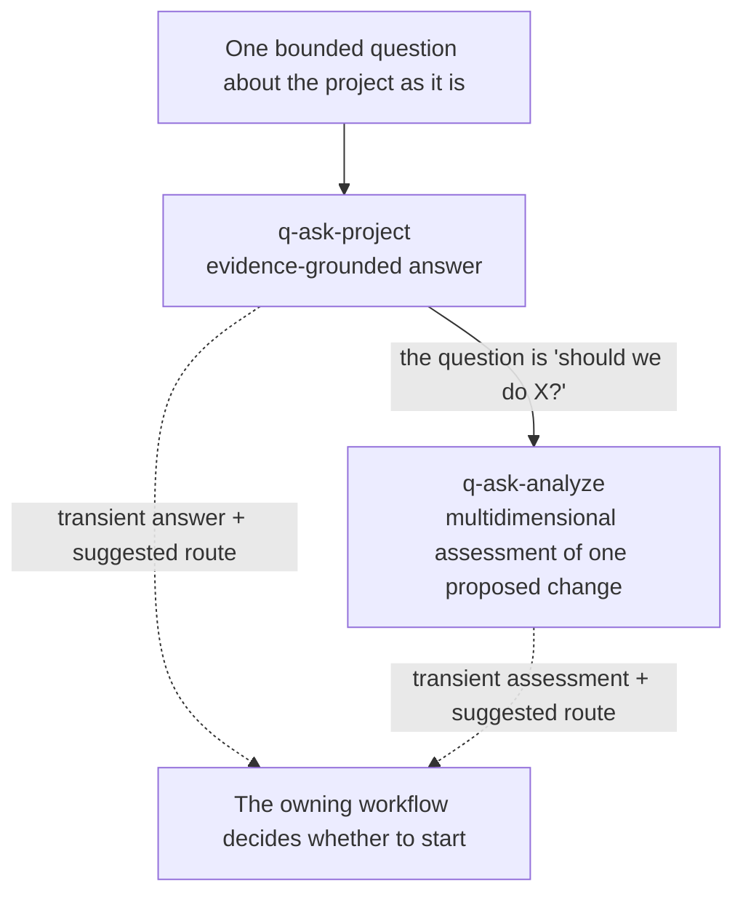

# Ask guide

The `ask` group answers a bounded question about a project as it already is. Both skills are read-only: they consume project documentation, workflow state, decisions, and observable implementation, and return conversation output that is never registered, never versioned, and never a stage completion. Use them to decide what to do next — not to do it.

This guide is an explanatory view. [`skill-manifest.yaml`](../../skill-manifest.yaml) is the registry; each `SKILL.md` owns its procedure.

## How asking flows

## When to use each skill

| Skill | Use it when |
|---|---|
| [`q-ask-project`](q-ask-project/SKILL.md) | You need one bounded answer from project truth: what a decision was, where a rule lives, what state a stage is in, how something is currently implemented. It separates what the evidence shows from what it does not. |
| [`q-ask-analyze`](q-ask-analyze/SKILL.md) | One change has already been proposed and you want it assessed against project truth across dimensions — feasibility, impact, risk, alignment — before committing to it. It requires `q-ask-project` for the evidence path. |

## Boundaries

- Neither skill creates an artifact, updates `00-workflow-state.yaml` or `00-artifact-index.yaml`, or marks a stage complete. Output is transient by declaration.
- A routing recommendation is a suggested next route, not authorization to start it. The user opens the workflow.
- An answer states its evidence and its gaps. Absent evidence is reported as absent, never filled in from plausibility.
- `q-ask-analyze` assesses a change that already exists as a proposal. It does not generate the option set.

## Integration with the other groups

These are the read-only lens over any workflow's project state; they are cross-cutting and appear at any point. Keep the three exploratory capabilities distinct: `q-ask-analyze` evaluates one already-proposed change against project truth, [`q-research-workflow`](../research/README.md) reduces an *external* uncertainty with cited evidence, and [`q-ideation-session`](../ideation/README.md) runs when the option set itself is the open question. Both ask skills require the shared governance companion (see the [core guide](../core/README.md)).
