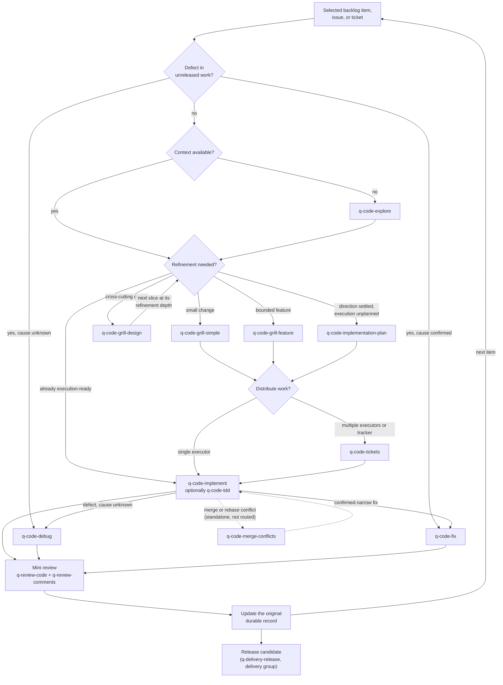

# Development loop guide

The `code` group holds the execution skills for one backlog item, issue, ticket, or plan: orientation, right-sized refinement, optional ticketing, implementation, and trouble handling. The loop runs orchestrated inside the [delivery workflow](../delivery/README.md) or standalone on any codebase.

This guide is an explanatory view. [`skill-manifest.yaml`](../../skill-manifest.yaml) is the registry; each `SKILL.md` owns its procedure.

## How the loop flows

Skip any step whose purpose is already met: orientation when context exists, refinement when the item is execution-ready, tickets for a single executor. Verification proportional to the change and its acceptance criteria is always required; TDD is opt-in.

## When to use each skill

| Skill | Use it when |
|---|---|
| [`q-code-explore`](q-code-explore/SKILL.md) | Orienting in an unfamiliar codebase or document with evidence-grounded findings — including one abstraction level above a named code location — before planning, implementing, reviewing, or explaining. |
| [`q-code-grill-simple`](q-code-grill-simple/SKILL.md) | Aligning a small scoped change into a short plan. |
| [`q-code-grill-feature`](q-code-grill-feature/SKILL.md) | Aligning a bounded feature into an implementation plan when behavior, scope, integration, or acceptance questions are still open. |
| [`q-code-grill-design`](q-code-grill-design/SKILL.md) | Aligning a cross-cutting architectural change through a deep interview. |
| [`q-code-implementation-plan`](q-code-implementation-plan/SKILL.md) | Planning file-level execution when direction is already settled and no material alignment question is open. |
| [`q-code-tickets`](q-code-tickets/SKILL.md) | Distributing settled work as durable tickets across executors, sessions, or a tracker. |
| [`q-code-implement`](q-code-implement/SKILL.md) | Executing a ready backlog item, issue, ticket, or plan with proportional verification. |
| [`q-code-tdd`](q-code-tdd/SKILL.md) | Running an explicitly chosen red-green loop, inside `q-code-implement` or standalone while building new behavior. |
| [`q-code-fix`](q-code-fix/SKILL.md) | Applying a confirmed narrow correction. |
| [`q-code-debug`](q-code-debug/SKILL.md) | Diagnosing a failure whose cause is unknown, with reproduction first. |
| [`q-code-merge-conflicts`](q-code-merge-conflicts/SKILL.md) | Resolving an active merge or rebase conflict with operation-scoped Git approval. Standalone-only: the implementer or user invokes it during the loop; the orchestrator does not route to it. |
| [`q-code-research`](q-code-research/SKILL.md) | Building a cited technical Findings Register from official documentation, specifications, source code, or APIs. |
| [`q-code-prototype`](q-code-prototype/SKILL.md) | Running a throwaway experiment in an isolated branch and worktree; stages and commits only on the named prototype branch, and only with explicit approval. Standalone-only. |
| [`q-code-explain`](q-code-explain/SKILL.md) | Rephrasing the immediately preceding technical explanation more clearly. Standalone-only. |
| [`q-code-handoff`](q-code-handoff/SKILL.md) | Pausing or transferring work with a durable session handoff. Standalone-only. |

`q-code-merge-conflicts`, `q-code-prototype`, `q-code-explain`, and `q-code-handoff` are standalone-only (`execution_modes: [standalone]` in the manifest): the user or implementer invokes them; the orchestrator never routes to them.

## Boundaries

- An implementation scratchpad or internal delegation is never a durable project plan; durable plans come from the grills or the implementation plan.
- `q-code-grill-feature` and `q-code-implementation-plan` write the same artifact type (`implementation-plan`, canonical for `planned-execution`). The difference is the entry condition, not the output: the grill is a dialogue-led alignment for work with open behavior, scope, integration, or acceptance questions and adds the alignment record to the plan; the implementation plan is decision-gated planning of settled work. One item gets one plan.
- The three grills are one ladder (`q-code-grill-design` > `q-code-grill-feature` > `q-code-grill-simple`): each escalates or de-escalates to the neighbouring depth when scope turns out larger or smaller than assumed, and `q-code-grill-simple` hands a change that proves to be a defect to `q-code-fix` or `q-code-debug`. One item still ends with one plan.
- The durable records for one item have a fixed precedence (see the contract's development-loop section): the backlog item is the commitment, the plan or feature architecture document is its execution record, and a ticket set derives from the plan. A plan or ticket that would change the item's scope, priority, or acceptance criteria returns the item to `q-plan-backlog` instead of redefining them.
- Tickets and TDD are optional by default; making them mandatory is an anti-pattern.
- A `q-code-grill-design` feature architecture document is canonical only for that change: it lives under the planning docs root, shares the planning ADR home, yields to the planning versions it cites, and returns a contradiction to the owning planning stage instead of overriding it.
- `q-code-research` shares the cited-findings contract with engagement research but not its workflow (see the [research guide](../research/README.md)).
- The mini review (`q-review-code` + `q-review-comments`) is required after every change by `q-code-implement`, `q-code-fix`, and `q-code-debug`; a missing reviewer is a blocker in the close, never a skip. A defect in unreleased work goes to fix or debug inside the loop, a defect in a `Released` version to the hotfix route.
- Every loop skill that authors or updates a durable record — the three grills, the implementation plan, tickets, implement, fix, and debug — returns a `stage_result`. Orchestrated, the delivery workflow reconciles it before the next step; standalone, the skill persists it beside the artifact so a later orchestrated run can.

## Integration with the other groups

The mini review that closes each iteration lives in the [review group](../review/README.md). Orchestrated runs receive the item the user selected from the backlog `q-plan-backlog` owns ([plan group](../plan/README.md)), routed by the [delivery workflow](../delivery/README.md), and return deltas to it. `q-code-explore` requires `q-code-grill-design` (its deep-module glossary). Declared tool collaborations (see the [shared tools guide](../tool/README.md)): the three refinement planners (`q-code-grill-design`, `q-code-grill-feature`, `q-code-implementation-plan`) and `q-code-debug` may use `q-tool-database-schema`; `q-code-grill-design` and `q-code-explore` may use `q-tool-mermaid`. `q-code-explore` may also be called by `q-consult-current-state` when an assessed process is embodied in software (see the [consulting execution guide](../consult/README.md)).
