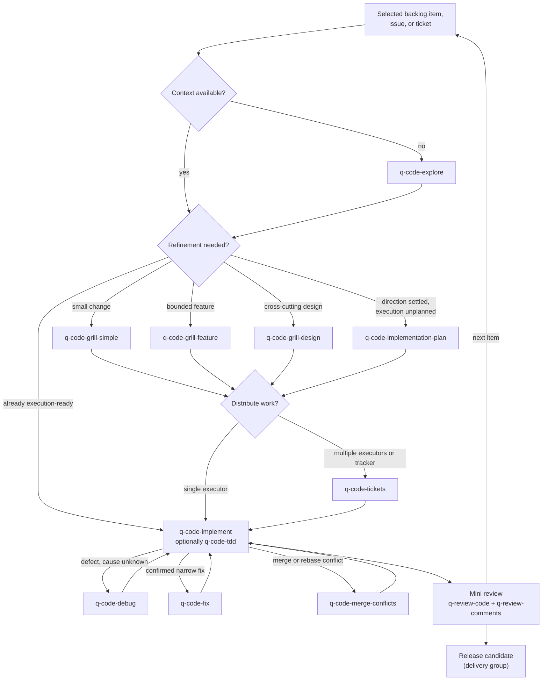

# Development loop guide

The `code` group holds the execution skills for one backlog item, issue, ticket, or plan: orientation, right-sized refinement, optional ticketing, implementation, and trouble handling. The loop runs orchestrated inside the [delivery workflow](../delivery/README.md) or standalone on any codebase.

This guide is an explanatory view. [`skill-manifest.yaml`](../../skill-manifest.yaml) is the registry; each `SKILL.md` owns its procedure.

## How the loop flows

Skip any step whose purpose is already met: orientation when context exists, refinement when the item is execution-ready, tickets for a single executor. Verification proportional to risk is always required; TDD is opt-in.

## When to use each skill

| Skill | Use it when |
|---|---|
| [`q-code-explore`](q-code-explore/SKILL.md) | Orienting in unfamiliar code with evidence-grounded findings — including one abstraction level above a named location — before planning, implementing, reviewing, or explaining. |
| [`q-code-grill-simple`](q-code-grill-simple/SKILL.md) | Aligning a small scoped change into a short plan. |
| [`q-code-grill-feature`](q-code-grill-feature/SKILL.md) | Aligning a bounded feature into an implementation plan when behavior, scope, integration, or acceptance questions are still open. |
| [`q-code-grill-design`](q-code-grill-design/SKILL.md) | Aligning a cross-cutting architectural change through a deep interview. |
| [`q-code-implementation-plan`](q-code-implementation-plan/SKILL.md) | Planning file-level execution when direction is already settled and no material alignment question is open. |
| [`q-code-tickets`](q-code-tickets/SKILL.md) | Distributing settled work as durable tickets across executors, sessions, or a tracker. |
| [`q-code-implement`](q-code-implement/SKILL.md) | Executing a ready backlog item, issue, ticket, or plan with proportional verification. |
| [`q-code-tdd`](q-code-tdd/SKILL.md) | Running an explicitly chosen red-green loop during implementation. |
| [`q-code-fix`](q-code-fix/SKILL.md) | Applying a confirmed narrow correction. |
| [`q-code-debug`](q-code-debug/SKILL.md) | Diagnosing a failure whose cause is unknown, with reproduction first. |
| [`q-code-merge-conflicts`](q-code-merge-conflicts/SKILL.md) | Resolving an active merge or rebase conflict with operation-scoped Git approval. Standalone-only: the implementer or user invokes it during the loop; the orchestrator does not route to it. |
| [`q-code-research`](q-code-research/SKILL.md) | Building a cited technical Findings Register from official documentation, specifications, source code, or APIs. |
| [`q-code-prototype`](q-code-prototype/SKILL.md) | Running a throwaway experiment in an isolated branch and worktree. |
| [`q-code-explain`](q-code-explain/SKILL.md) | Rephrasing the immediately preceding technical explanation more clearly. |
| [`q-code-handoff`](q-code-handoff/SKILL.md) | Pausing or transferring work with a durable session handoff. |

## Boundaries

- An implementation scratchpad or internal delegation is never a durable project plan; durable plans come from the grills or the implementation plan.
- `q-code-grill-feature` and `q-code-implementation-plan` write the same artifact type (`implementation-plan`, canonical for `planned-execution`). The difference is the entry condition, not the output: the grill is a dialogue-led alignment for work with open behavior, scope, integration, or acceptance questions and adds the alignment record to the plan; the implementation plan is decision-gated planning of settled work. One item gets one plan.
- Tickets and TDD are optional by default; making them mandatory is an anti-pattern.
- A `q-code-grill-design` feature architecture document is canonical only for that change: it lives under the planning docs root, shares the planning ADR home, yields to the planning versions it cites, and returns a contradiction to the owning planning stage instead of overriding it.
- `q-code-research` shares the cited-findings contract with engagement research but not its workflow (see the [research guide](../research/README.md)).
- Every loop skill that authors or updates a durable record — the three grills, the implementation plan, tickets, and implement — returns a `stage_result`. Orchestrated, the delivery workflow reconciles it before the next step; standalone, the skill persists it beside the artifact so a later orchestrated run can.

## Integration with the other groups

The mini review that closes each iteration lives in the [review group](../review/README.md). Orchestrated runs receive their item from the [delivery workflow](../delivery/README.md) backlog and return deltas to it. `q-code-explore` requires `q-code-grill-design` (its deep-module glossary); refinement and debugging may optionally use `q-tool-database-schema` or `q-tool-mermaid` (see the [shared tools guide](../tool/README.md)).
