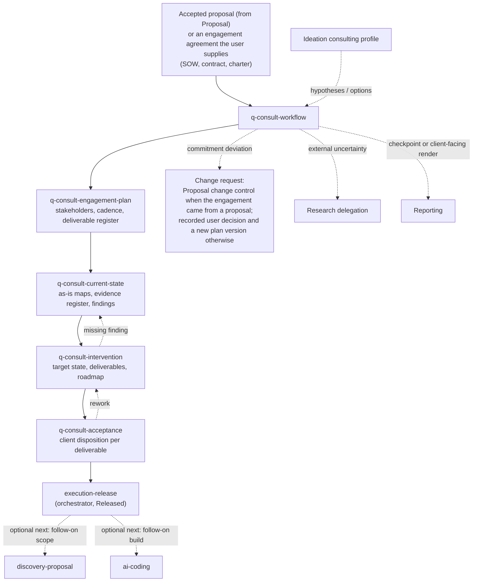

# Consulting execution guide

The `consult` group executes an accepted consulting, assessment, training, or managed-service engagement — or the non-software scope of a mixed one — from kickoff to recorded client acceptance. `q-consult-workflow` routes four stages and writes the execution release; the stages own the engagement plan, the assessed current state and its evidence, the intervention design and deliverables, and the acceptance record. Nothing here edits the accepted proposal or supplied engagement agreement.

This guide is an explanatory view. [`skill-manifest.yaml`](../../skill-manifest.yaml) is the registry; each `SKILL.md` owns its procedure.

## How an engagement flows

## When to use each skill

| Skill | Use it when |
|---|---|
| [`q-consult-workflow`](q-consult-workflow/SKILL.md) | Starting, resuming, routing, or recovering an engagement; running one named stage; writing the execution release after recorded acceptance; opening change control. It owns workflow state and the artifact index. |
| [`q-consult-engagement-plan`](q-consult-engagement-plan/SKILL.md) | Turning the accepted proposal or supplied engagement agreement into stakeholders, cadence, evidence access, and a deliverable register with criteria by reference; reconciling the plan after an approved change. |
| [`q-consult-current-state`](q-consult-current-state/SKILL.md) | Mapping how the client works today, registering evidence (with verified PDF/DOCX/XLSX/CSV extraction), diagnosing with confidence and gaps, validating hypotheses. Never designs the remedy. |
| [`q-consult-intervention`](q-consult-intervention/SKILL.md) | Designing the target state, authoring each deliverable at its declared scope, and the adoption roadmap from confirmed findings. May delegate a confirmed target-state or operating-model diagram to `q-tool-mermaid` and run a `q-tool-humanizer` pass over the client-facing prose before its gate. Never accepts its own work. |
| [`q-consult-acceptance`](q-consult-acceptance/SKILL.md) | Presenting deliverables at exact versions against proposal criteria and recording the client's disposition — accepted, with reservations, rework, rejected, or deferred — with evidence. |

## Boundaries

- Execution never edits the accepted proposal or agreement; a deviation from scope, price, schedule, deliverables, or criteria opens a change request — routed to Proposal change control when the engagement came from a proposal, otherwise recorded as the user's decision with a new engagement-plan version.
- A finding cites registered evidence or stays a hypothesis; assessment is not discovery (pre-sale) and not research (external uncertainty).
- Intervention is not ideation: options may come from an adopted snapshot, the design is decided here.
- Acceptance is recorded from the client, never inferred from a delivered file, an internal review, or silence; only the orchestrator marks anything `Released`.
- Client-facing DOCX, PDF, or deck renders of an accepted deliverable go through reporting delegation and stay derived.

## Integration with the other groups

The engagement's commercial reference is either an accepted non-development proposal from the [proposal workflow](../proposal/README.md) or an engagement agreement the user supplies — a statement of work, contract, or charter — registered as such; a mixed engagement's software scope goes to [delivery](../delivery/README.md) through the proposal's development handoff, not through this group. Assessment may delegate extraction to `q-tool-pdf`, `q-tool-document`, and `q-tool-spreadsheet`, diagrams to `q-tool-mermaid` (see the [shared tools guide](../tool/README.md)), a process embodied in software to `q-code-explore` ([code guide](../code/README.md)), and a misleading claim to `q-review-evidence`; acceptance may call `q-review-docs` ([review guide](../review/README.md)). An external uncertainty may be delegated to [research](../research/README.md); a checkpoint or a client-facing render is a [report](../report/README.md). Structured ideation is an optional collaborator declared in the manifest. After the execution release the orchestrator offers, and never auto-starts, reporting, `discovery-proposal` for follow-on scope, `ai-coding` for a follow-on build, or close.

Invoke a stage directly only when standalone output is intentional: a standalone stage writes its owned artifact, returns `reconciliation_required: true`, persists that result beside the artifact, and does not claim global workflow completion.
