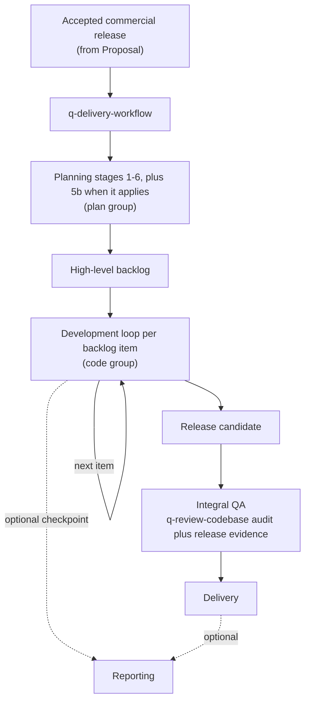

# Delivery workflow guide

The `delivery` group holds one skill: `q-delivery-workflow`, the orchestrator of the AI-coding workflow. It routes an accepted software engagement through planning, iterative development, integral QA, and delivery, and it is the only writer of the project's workflow state and artifact index.

This guide is an explanatory view. [`skill-manifest.yaml`](../../skill-manifest.yaml) is the registry; the [`q-delivery-workflow` SKILL.md](q-delivery-workflow/SKILL.md) owns the procedure.

## How delivery flows

## What the orchestrator owns

| Concern | How it works |
|---|---|
| Routing | Selects the next planning stage, backlog item, loop step, QA, or delivery action; a named `target_stage` runs one stage only. |
| Single writer | Stages return deltas; only the orchestrator writes `00-workflow-state.yaml` and `00-artifact-index.yaml`. |
| Runtime references | Carries `technical_foundation_ref` and `design_system_ref` so later stages load exact approved versions. |
| Release | Reconciles the codebase audit with integration, migration, deployment, and acceptance evidence; the audit alone is not acceptance. |
| Recovery | Rebuilds a consistent state when runtime records and artifacts have drifted. |

## Integration with the other groups

Planning stages live in the [plan group](../plan/README.md); the per-item development loop lives in the [code group](../code/README.md); the mini review and the codebase audit live in the [review group](../review/README.md). Delegated reporting returns a composite delta and resumes at the supplied return target (see the [reporting guide](../report/README.md)). Structured ideation and standalone database analysis are optional collaborators declared in the manifest.

Invoke a stage directly only when standalone output is intentional: a standalone stage writes its owned artifact, returns `reconciliation_required: true`, and does not claim global workflow completion.
