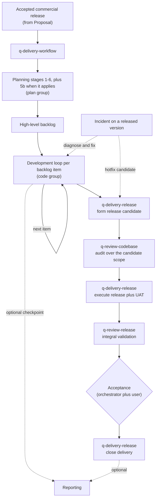

# Delivery workflow guide

The `delivery` group holds two skills: `q-delivery-workflow`, the orchestrator of the AI-coding workflow, and `q-delivery-release`, its release engineering stage. The orchestrator routes an accepted software engagement through planning, iterative development, release, integral QA, and delivery, and it is the only writer of the project's workflow state and artifact index.

This guide is an explanatory view. [`skill-manifest.yaml`](../../skill-manifest.yaml) is the registry; each `SKILL.md` owns its procedure.

## How delivery flows

## When to use each skill

| Skill | Use it when |
|---|---|
| [`q-delivery-workflow`](q-delivery-workflow/SKILL.md) | Starting, resuming, routing, or recovering a software delivery; running one named planning stage; coordinating the development loop; deciding release acceptance; opening the hotfix route for an incident on a released version. |
| [`q-delivery-release`](q-delivery-release/SKILL.md) | Forming a release candidate from an exact base commit, executing approved deployments and migrations or recording human-executed steps, drilling rollback, coordinating UAT, and closing delivery with the manifest and release notes. It never validates its own release. |

## What the orchestrator owns

| Concern | How it works |
|---|---|
| Routing | Selects the next planning stage, backlog item, loop step, QA, or delivery action; a named `target_stage` runs one stage only. |
| Single writer | Stages return deltas; only the orchestrator writes `00-workflow-state.yaml` and `00-artifact-index.yaml`. The development loop returns deltas too: each grill, plan, ticket set, and implementation close returns a `stage_result` that is reconciled before the next step. |
| Runtime references | Carries `technical_foundation_ref` and `design_system_ref` so later stages load exact approved versions. |
| Release | Routes candidate formation, execution, UAT, and validation to their owners; records the acceptance decision; marks lifecycles. The audit alone is not acceptance. |
| Recovery | Rebuilds a consistent state when runtime records and artifacts have drifted, including standalone stage results persisted beside their artifacts. |

## Integration with the other groups

Planning stages live in the [plan group](../plan/README.md); the per-item development loop lives in the [code group](../code/README.md); the mini review, the codebase audit, and the integral release validation live in the [review group](../review/README.md). Delegated reporting returns a composite delta and resumes at the supplied return target (see the [reporting guide](../report/README.md)). Structured ideation and standalone database analysis are optional collaborators declared in the manifest.

Invoke a stage directly only when standalone output is intentional: a standalone stage writes its owned artifact, returns `reconciliation_required: true`, and does not claim global workflow completion.
