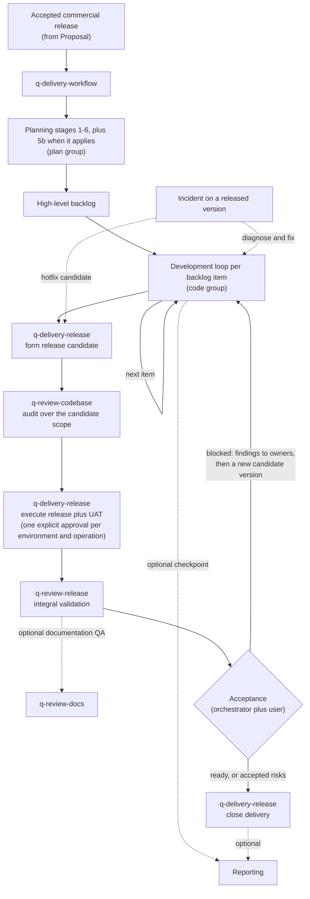

# Delivery workflow guide

The `delivery` group holds two skills: `q-delivery-workflow`, the orchestrator of the AI-coding workflow, and `q-delivery-release`, its release engineering stage. The orchestrator routes a product idea or accepted software engagement through planning, iterative development, release, integral QA, and delivery, and it is the only writer of its own run's workflow state and artifact index, kept under the run's artifact root (`docs/development-workflow/`); another root run in the same project — a proposal, consulting execution, research, or reporting — keeps its own.

This guide is an explanatory view. [`skill-manifest.yaml`](../../skill-manifest.yaml) is the registry; each `SKILL.md` owns its procedure.

## How delivery flows

## When to use each skill

| Skill | Use it when |
|---|---|
| [`q-delivery-workflow`](q-delivery-workflow/SKILL.md) | Starting, resuming, routing, or recovering a software delivery; running one named planning stage; coordinating the development loop; deciding release acceptance; opening the hotfix route for an incident on a released version. |
| [`q-delivery-release`](q-delivery-release/SKILL.md) | Forming a release candidate from an exact base commit, executing approved deployments and migrations or recording human-executed steps, drilling rollback, coordinating UAT, and closing delivery with the manifest and release notes. It never validates its own release. |

## What the orchestrator owns

| Concern | How it works |
|---|---|
| Routing | Selects the next planning stage, backlog item, loop step, QA, or delivery action; a named `target_stage` runs one stage only. |
| Single writer | Stages return deltas; only the orchestrator writes this run's `00-workflow-state.yaml` and `00-artifact-index.yaml`. The development loop returns deltas too: each grill, plan, ticket set, implementation close, and fix or debug close returns a `stage_result` that is reconciled before the next step. |
| Defect route | A defect item in work that is not yet `Released` skips the grill and goes to `q-code-debug` (cause unknown) or `q-code-fix` (cause confirmed), then rejoins the loop at the durable-record update; a defect against a `Released` version goes to the hotfix route instead. |
| Runtime references | Carries `technical_foundation_ref` and `design_system_ref` so later stages load exact approved versions. |
| Release | Routes candidate formation, execution, UAT, and validation to their owners; every deployment or migration needs its own explicit approval per environment and per operation, and production is never inferred from a lower environment (see the contract's Release engineering section); records the acceptance decision — `ready` or `ready_with_accepted_risks` closes delivery, `blocked` returns findings to the loop and forms a new candidate version; marks lifecycles. The audit alone is not acceptance. |
| Recovery | Rebuilds a consistent state when runtime records and artifacts have drifted, including standalone stage results persisted beside their artifacts. |

## Integration with the other groups

Planning stages live in the [plan group](../plan/README.md); the per-item development loop lives in the [code group](../code/README.md); the mini review, the codebase audit, and the integral release validation live in the [review group](../review/README.md). Documentation QA by `q-review-docs` is optional: the orchestrator or `q-review-release` routes to it when the user asks for it or the release risk warrants a documentation pass; its diagnostic stays transient. Delegated reporting returns a composite delta and resumes at the supplied return target (see the [reporting guide](../report/README.md)). Delegated [research](../research/README.md) returns the same way; the root then records `adopt-as-planning-input`, `retain-as-independent`, or `defer-decision`, and only `q-plan-product-core` or `q-plan-tech-foundation` registers an adopted baseline. Structured ideation and standalone database analysis are optional collaborators declared in the manifest.

Invoke a stage directly only when standalone output is intentional: a standalone stage writes its owned artifact, returns `reconciliation_required: true`, and does not claim global workflow completion.
