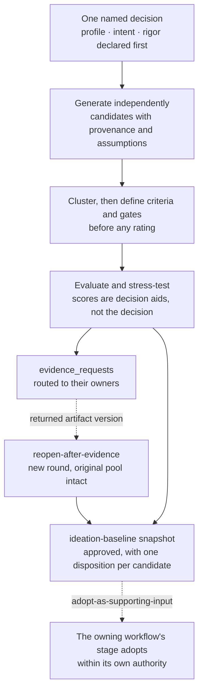

# Ideation guide

The `ideation` group runs when the option set itself is the open question. One session turns a named decision into a traceable candidate space — independent generation, explicit provenance, predeclared weighted criteria, non-compensatory gates, adversarial review, routed evidence requests — and ends at an approved snapshot with one disposition per candidate. Every candidate is a proposal. It never becomes a client fact, a requirement, an ADR, a stack selection, scope, price, or a commitment except through the owning workflow's own procedure.

This guide is an explanatory view. [`skill-manifest.yaml`](../../skill-manifest.yaml) is the registry; each `SKILL.md` owns its procedure.

## How a session flows

## When to use each skill

| Skill | Use it when |
|---|---|
| [`q-ideation-session`](q-ideation-session/SKILL.md) | Brainstorming, problem framing, option generation, stress-testing an option set, an improvement-opportunity sweep over an existing product or service, workshop facilitation, strategic or intervention alternatives, research-direction ideation, or reopening options after new evidence arrived. For one already-chosen option, use the owning analysis, planning, or research skill instead. |

**Three dimensions declared before generating anything.** `profile` — `scientific`, `product`, `consulting`, or `general` — selects the vocabulary and candidate kinds; `intent` — `frame-problem`, `generate-options`, `stress-test-options`, or `reopen-after-evidence` — selects the route; the declared rigor sets how much evaluation ceremony the decision earns. An opportunity-discovery sweep is `profile: product` with its own reference.

**Four dispositions on return**, recorded by the consuming root orchestrator: `adopt-as-supporting-input` (register the exact snapshot version and mark it `Baselined`), `retain-as-independent`, `defer-decision`, or `reject`. A snapshot without an approval block is eligible only for the last two.

## Boundaries

- The session never investigates evidence. An uncertainty leaves as a routed `evidence_request` and returns only under `intent: reopen-after-evidence` with the exact returned artifact version.
- Scores, intervals, and sensitivity are decision aids. The decision owner's explicit disposition is the decision; a weighted matrix never names a winner on its own.
- Gates — safety, privacy, legal and regulatory, ethics and equity, commercial authority, confidentiality, minimum capability, non-negotiable incompatibility — stay outside the score, not folded into it as another weighted criterion.
- Criteria are defined before any rating. A later round produces a new snapshot version and keeps the original candidate pool intact.
- Standalone, the approval lives in the snapshot's own `approval` block; adoption exists only when an adopting root records it, so a snapshot nobody adopted has no adoption record by design.

## Integration with the other groups

Each receiving owner adopts only what its authority allows, listed in [`references/handoffs.md`](q-ideation-session/references/handoffs.md): problem frames and interpretation risks into [proposal](../proposal/README.md) discovery; solution and engagement options into proposal design; diagnostic hypotheses and intervention options into [consulting execution](../consult/README.md); evidence requests and candidate questions into [research](../research/README.md) scope; a selected option and outcome hypothesis into [`q-plan-product-core`](../plan/README.md), with technology and architecture alternatives to their own stages; feasibility hypotheses to `q-code-prototype` in the [code group](../code/README.md); an approved snapshot into a [report](../report/README.md) source as candidates, never as facts. `q-code-explore` may provide optional current-state orientation. Keep the three exploratory capabilities distinct: [`q-ask-analyze`](../ask/README.md) evaluates one already-proposed change, research reduces an external uncertainty with cited evidence, and this group runs when the options themselves are unknown.
