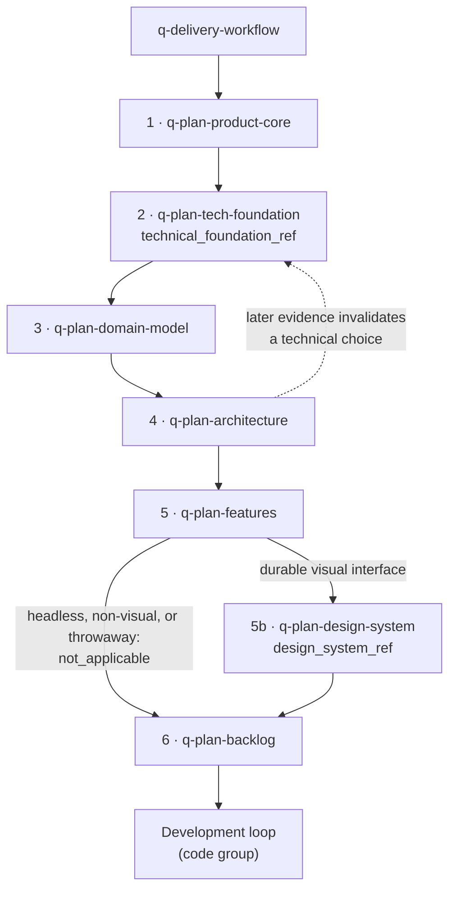

# Planning stages guide

The `plan` group holds the seven ordered stages that take an accepted product idea to a validated high-level backlog. The [delivery workflow](../delivery/README.md) orchestrates them; each stage owns its artifacts and returns a delta instead of writing global state.

This guide is an explanatory view. [`skill-manifest.yaml`](../../skill-manifest.yaml) is the registry; each `SKILL.md` owns its procedure.

## How planning flows

Stage 5b is conditional and does not shift the other stage numbers. Any later stage or development-loop refinement that contradicts an upstream artifact reports the contradiction and routes reconciliation to the owner, which reconciles by creating a new version instead of editing the baselined one.

## When to use each skill

| Skill | Use it when |
|---|---|
| [`q-plan-product-core`](q-plan-product-core/SKILL.md) | Establishing product intent, actors, journeys, requirements, rules, scope, exclusions, and pending decisions. |
| [`q-plan-tech-foundation`](q-plan-tech-foundation/SKILL.md) | Selecting or reconciling stack, concrete versions, NFRs, security, testing, deployment, and operations. Return here when later evidence invalidates a technical choice. |
| [`q-plan-domain-model`](q-plan-domain-model/SKILL.md) | Defining domain concepts, relationships, ownership, lifecycles, invariants, retention, and the supporting ERD. |
| [`q-plan-architecture`](q-plan-architecture/SKILL.md) | Defining system architecture, ADRs, application standards, boundaries, and optional evidence-grounded C4 or Mermaid views. |
| [`q-plan-features`](q-plan-features/SKILL.md) | Decomposing architecture into modules, vertical slices, behaviors, dependencies, and technical sequence. A C4 Component view is optional and only inside one confirmed container. |
| [`q-plan-design-system`](q-plan-design-system/SKILL.md) | Defining, adopting, or evolving reusable design contracts and a design token set for a product with a durable visual interface. |
| [`q-plan-backlog`](q-plan-backlog/SKILL.md) | Creating the first high-level rolling-wave backlog, refining the next front, or synchronizing an approved replan. |

## Stage notes

`q-plan-tech-foundation` owns `02-technical-foundation.md`, the canonical profile for stack selection, versions, NFR fit, and version-scoped references. For a suitable greenfield web application without a mandated stack, it recommends T3 Core — TypeScript, Next.js App Router, and tRPC — as an advisory starting point and evaluates secondary candidates only when their conditions hold. The user confirms every material selection; the recommendation is never a mandatory stack.

`q-plan-design-system` authors contracts, never implementation: a specification (`05b-design-system.md`) and a machine-readable token set (`05b-design-tokens.json`) with separated authority. It chooses no UI library, writes no component code, and claims no conformance — planning records the accessibility target (web default `WCAG 2.2 Level AA`) and the expected evidence, while implementation and QA establish it. A token set comes only from confirmed values; an unavailable validator produces an explicit `token_validation: unverified` gap instead of a false approval.

## Integration with the other groups

`q-plan-domain-model` and `q-plan-architecture` require `q-tool-mermaid`; architecture and features optionally use `q-tool-c4`; several stages optionally use `q-tool-database-schema` (see the [shared tools guide](../tool/README.md)). Backlog output feeds the [development loop](../code/README.md). Design-system conformance is reviewed inside the standards axis of the [review group](../review/README.md), never as a third authority axis.
