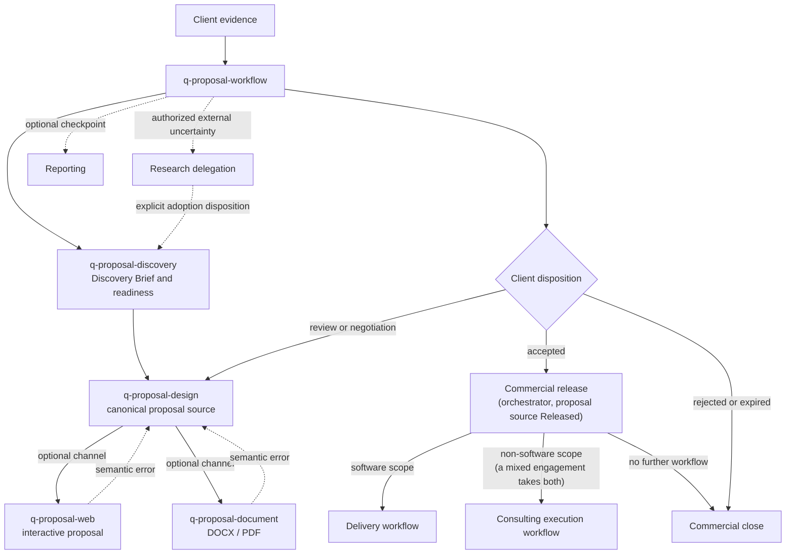

# Discovery and proposal guide

The `proposal` group turns raw client evidence into a traceable discovery brief, a canonical commercial proposal, and optional web and document channels. Commercial meaning lives in one source owned by Proposal Design; every channel regenerates from it and never rewrites it.

This guide is an explanatory view. [`skill-manifest.yaml`](../../skill-manifest.yaml) is the registry; each `SKILL.md` owns its procedure.

## How a proposal flows

## When to use each skill

| Skill | Use it when |
|---|---|
| [`q-proposal-workflow`](q-proposal-workflow/SKILL.md) | Starting, resuming, or reconciling the commercial flow; name a target stage when only one stage is needed. It owns workflow state, the artifact index, and the commercial release. |
| [`q-proposal-discovery`](q-proposal-discovery/SKILL.md) | Turning client evidence into a traceable brief, open questions, risks, and a proposal-readiness assessment. |
| [`q-proposal-design`](q-proposal-design/SKILL.md) | Defining canonical scope, solution, deliverables, schedule, investment, terms, and commitments. |
| [`q-proposal-web`](q-proposal-web/SKILL.md) | Rendering an interactive proposal from approved commercial meaning; publication remains a separate approval. |
| [`q-proposal-document`](q-proposal-document/SKILL.md) | Generating, visually validating, reconciling, and releasing proposal DOCX/PDF files without changing commercial meaning. |

## Boundaries

- No fabrication: Discovery records what the client evidence supports and routes blocking assumptions to the user.
- A channel renderer never rewrites accepted commercial scope; semantic errors return to Proposal Design.
- Release approval and publication are separate approvals.
- An adopted research baseline enters as `external-research` through an explicit disposition; Research never edits the Discovery Brief.
- An adopted ideation snapshot enters as supporting input only; a candidate never becomes a client fact, requirement, scope, price, schedule, or commitment except through Discovery's or Proposal Design's own procedure.

## Integration with the other groups

An accepted software engagement continues to the [delivery workflow](../delivery/README.md). A consulting, assessment, training, or managed-service engagement — or the non-software scope of a mixed one — continues to the [consulting execution workflow](../consult/README.md). A mixed engagement receives both handoffs. A material external uncertainty may be delegated to [research](../research/README.md). Discovery may call `q-review-evidence` (see the [review guide](../review/README.md)) for a claim that could mislead a commitment, and may take supplied client PDF, DOCX, XLSX, or CSV evidence through verified extraction with `q-tool-pdf`, `q-tool-document`, or `q-tool-spreadsheet`. `q-proposal-design` may run a `q-tool-humanizer` pass over the commercial prose before its gate, and `q-proposal-web` only over the headings, navigation, and section introductions of the web presentation plan it authors — never over a sentence reproduced from the approved source. `q-proposal-web` may also render a structural diagram through `q-tool-mermaid`. `q-proposal-workflow` may route a bounded [ideation session](../ideation/README.md) before discovery or proposal design and records one adoption disposition on return. `q-proposal-document` requires `q-proposal-design`; it may delegate DOCX mechanics to `q-tool-document` and PDF inspection or validation to `q-tool-pdf`, while PDF production stays in its own verified local route (see the [shared tools guide](../tool/README.md)). A commercial checkpoint may optionally produce a [report](../report/README.md), including a presentation deck of the approved proposal rendered by `q-report-deck`; the proposal workflow has no deck channel of its own.
