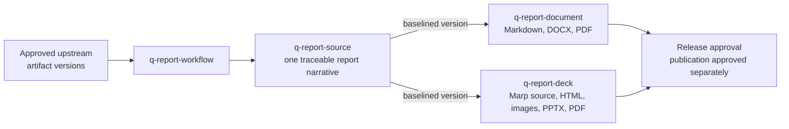

# Reporting guide

The `report` group turns approved artifact versions from other workflows into a traced report and its rendered channels. Report meaning lives in one baselined source; every rendered channel is derived and carries no semantic authority.

This guide is an explanatory view. [`skill-manifest.yaml`](../../skill-manifest.yaml) is the registry; each `SKILL.md` owns its procedure.

## How a report flows

## When to use each skill

| Skill | Use it when |
|---|---|
| [`q-report-workflow`](q-report-workflow/SKILL.md) | Routing a progress, feature, milestone, release, completion, consulting, executive, or custom report from explicit artifact IDs and versions. `content_profile: general` or `market-research` selects the semantic source pattern. |
| [`q-report-source`](q-report-source/SKILL.md) | Synthesizing the approved source bundle into one reporting narrative before any rendering. Canonical only for selection, narrative, and approved interpretation. |
| [`q-report-document`](q-report-document/SKILL.md) | Rendering a baselined report source as Markdown, DOCX, and PDF. |
| [`q-report-deck`](q-report-deck/SKILL.md) | Rendering a baselined report source, or a standalone Quasar presentation — including a proposal deck delegated by the proposal workflow — as an editable Marp bundle, HTML, images, PPTX, or PDF. |

## Delegation and ownership

When Proposal or Delivery delegates reporting, the calling workflow remains root orchestrator and global state writer; reporting returns a composite delta and resumes at the supplied return target. When reporting is invoked directly, `q-report-workflow` is the root orchestrator. Release approval is always separate from publication or external sending.

The renderers delegate mechanics without losing ownership: `q-report-document` may hand DOCX work to `q-tool-document` and PDF work to `q-tool-pdf`; `q-report-deck` may hand Marp work to `q-tool-marp`, native PowerPoint work to `q-tool-pptx`, and PDF work to `q-tool-pdf`. Both may ask `q-tool-c4` or `q-tool-mermaid` to validate or render an approved visual, and never reconstruct a model from a screenshot. See the [shared tools guide](../tool/README.md).

A Marp channel preserves its Markdown, theme CSS, assets, render command, hashes, and runtime versions as an editable, regenerable source bundle; its renders stay derived. Standard Marp PPTX is a valid delivery render but is not object-editable — route an object-editable PowerPoint requirement through `q-tool-pptx`.

## Boundaries

- Upstream artifacts keep authority over their facts and commitments; a report may snapshot in-progress work only with its reporting period and `as_of` visible, and must not imply upstream completion.
- Market-research content uses typed refs that resolve to exact source-snapshot versions; reporting communicates promoted results and qualifiers and never searches, recalculates, or leans on a derived export as the only support.
- A C4 visual names the exact approved C4 artifact version and view ID.

## Integration with the other groups

[Proposal](../proposal/README.md), [consulting execution](../consult/README.md), [research](../research/README.md), and [delivery](../delivery/README.md) may all end or checkpoint in a report. The report source consumes their approved artifacts by exact ID and version and routes any needed upstream change back to the owner instead of editing it.
