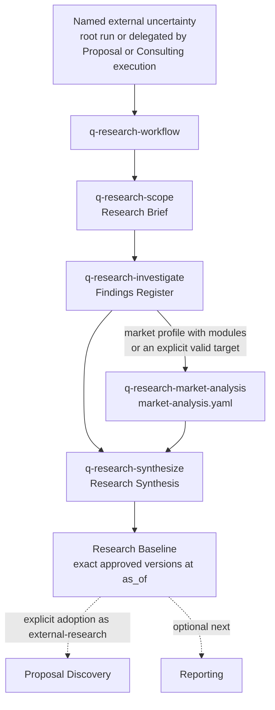

# Engagement research guide

The `research` group reduces one named external uncertainty — market, competitor, regulatory, technology, feasibility, or risk — into an approved, cited baseline. It may run as a root workflow or be delegated by Proposal or Consulting execution when the owning stage cannot responsibly resolve the question from client evidence. Completing a baseline never automatically opens Proposal or Reporting; every next workflow is an explicit choice.

This guide is an explanatory view. [`skill-manifest.yaml`](../../skill-manifest.yaml) is the registry; each `SKILL.md` owns its procedure.

## How research flows

The `general` profile skips Market Analysis; the `market` profile inserts it conditionally.

## When to use each skill

| Skill | Use it when |
|---|---|
| [`q-research-workflow`](q-research-workflow/SKILL.md) | Starting, resuming, or baselining a research run; it owns workflow state and the final baseline disposition. |
| [`q-research-scope`](q-research-scope/SKILL.md) | Defining stable decision-linked questions, boundaries, privacy limits, search strategies, and a time or cost budget before any investigation. Typed evidence requests from an ideation session also land here. |
| [`q-research-investigate`](q-research-investigate/SKILL.md) | Building a cited Findings Register with source identity, claim fit, independence, contradictions, and honest search coverage. |
| [`q-research-market-analysis`](q-research-market-analysis/SKILL.md) | Producing evidence-linked sizing, TAM/SAM/SOM, reconciliation, forecasts, sensitivity, competitor matrices, shares, CRn, HHI, and scenarios from exact brief and findings versions, with deterministic local tools and no network read. |
| [`q-research-synthesize`](q-research-synthesize/SKILL.md) | Answering the approved questions through stable finding and published-result refs, preserving debates and gaps, and running a counter-evidence check. |

## Boundaries

- The Research Baseline is canonical only for the approved snapshot; findings, analysis, and synthesis remain supporting evidence, and a baseline never declares `report-ready`.
- Verified source identity, claim support, and completed search coverage are three separate states.
- JSON/CSV/XLSX calculation workspaces are transient or derived exports with no semantic authority; a value must be promoted into `published_results` before Synthesis or Reporting can use it.
- The package includes no primary fieldwork: no participant contact, survey or interview operation, PII or recording storage, or raw response-level processing. Published aggregate evidence may be registered within its disclosed method limits.
- Research never edits the Discovery Brief and never creates a proposal commitment.

## Related capabilities

`q-code-research` (in the [code group](../code/README.md)) is the separate technical route for official documentation, specifications, source code, APIs, and versioned behavior; it shares the cited-findings contract but not this workflow. Investigation and Synthesis may call `q-review-evidence` (in the [review group](../review/README.md)) for materially fragile findings or inferences, keeping their own confidence and artifacts.

## Integration with the other groups

A [proposal](../proposal/README.md)-delegated run returns to Proposal for an explicit adoption, retention, or deferral disposition. A [consulting execution](../consult/README.md)-delegated run returns to `q-consult-workflow` for the same three dispositions, and an [ai-coding](../delivery/README.md)-delegated run to `q-delivery-workflow` with `adopt-as-planning-input`. `q-research-investigate` may take a supplied PDF, DOCX, XLSX, or CSV source through verified extraction with `q-tool-pdf`, `q-tool-document`, or `q-tool-spreadsheet` (see the [shared tools guide](../tool/README.md)); the extract is derived and the source stays cited. An [ideation session](../ideation/q-ideation-session/SKILL.md) may send evidence requests into scope and reopen after the baseline answers them. A baseline may optionally feed [reporting](../report/README.md) with `content_profile: market-research`.
