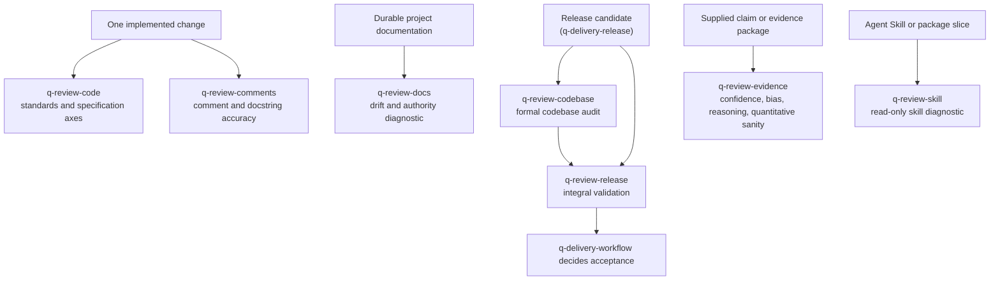

# Review and QA guide

The `review` group holds seven quality capabilities that never modify their target. Each returns findings, a diagnostic, an audit, or a validation for its exact scope; only `q-review-codebase` and `q-review-release` persist theirs — the audit as authored supporting evidence, the integral validation as the canonical record of release quality. None silently fixes what it finds, owns acceptance, or writes workflow state or the artifact index.

This guide is an explanatory view. [`skill-manifest.yaml`](../../skill-manifest.yaml) is the registry; each `SKILL.md` owns its procedure.

## Where each review attaches

## When to use each skill

| Skill | Use it when |
|---|---|
| [`q-review-code`](q-review-code/SKILL.md) | Checking one change for technical and specification conformance after implementation. Design-system conformance is a criterion inside its standards axis. |
| [`q-review-comments`](q-review-comments/SKILL.md) | Checking the accuracy of comments and docstrings affected by the same change. |
| [`q-review-codebase`](q-review-codebase/SKILL.md) | Auditing a codebase or release candidate across architecture, integration, critical flows, security, NFRs, migration, deployment, and documentation. The audit alone is not release acceptance. |
| [`q-review-release`](q-review-release/SKILL.md) | Reconciling a release candidate's evidence checklist — audit, tests, release execution, UAT, mini reviews, security, NFR, design system, documentation — into a `ready`, `ready_with_accepted_risks`, or `blocked` verdict. The verdict is evidence; the acceptance decision is not its to make. |
| [`q-review-docs`](q-review-docs/SKILL.md) | Auditing durable project documentation for structural breakage, authority errors, traceability gaps, contradictions, and drift. |
| [`q-review-evidence`](q-review-evidence/SKILL.md) | Auditing a supplied business, engineering, scientific, or clinical claim for confidence, bias, reasoning, quantitative, or methodological limits — without investigating the open question itself. |
| [`q-review-skill`](q-review-skill/SKILL.md) | Auditing an Agent Skill or a bounded package slice for activation, authority, context value, disclosure, safety, packaging, provenance, and behavior. |

## Evidence review as a collaborator

Five skills may call `q-review-evidence` through declared `uses` triggers: Research Investigation for a material finding with non-obvious confidence, Research Synthesis for a fragile material inference, Technical Research for benchmark, vendor, compatibility, reproducibility, or ML/AI claims, Proposal Discovery for a claim that could mislead a commercial commitment, and Current-State Assessment for a diagnostic conclusion that could mislead a recommendation. Every caller keeps its own artifact, confidence, and decision; when the reviewer is absent, the caller applies its existing factors and names the gap.

Scientific criteria (study hierarchies, GRADE, risk-of-bias instruments) load only for scientific or clinical material or an explicit request. A diagnostic is never peer review, certification, or professional medical or legal advice.

## Boundaries

- A review reports findings; fixes are separate, explicitly authorized work that returns to the owning skill.
- A codebase audit is input to `q-review-release`; [`q-delivery-workflow`](../delivery/README.md) owns the acceptance decision.
- A requested numeric skill score is a disclosed heuristic, never package acceptance.
- `q-review-code` and `q-review-comments` are the declared mini-review collaborators of `q-code-implement`, `q-code-fix`, and `q-code-debug`; when one is not installed the executor closes with a blocker naming it and its install command, and never reports the change as reviewed.
- Use `q-maint-ai-workflow`, not `q-review-docs`, for documentation owned by this package.

## Integration with the other groups

The mini review (`q-review-code` plus `q-review-comments`) closes every iteration of the [development loop](../code/README.md). The codebase audit feeds the integral validation, which reconciles it with the release evidence `q-delivery-release` produces in the [delivery workflow](../delivery/README.md). Evidence review serves [research](../research/README.md), [proposal](../proposal/README.md), and consulting callers. Consulting acceptance may call `q-review-docs` over a deliverable set (see the [consulting execution guide](../consult/README.md)). For this repository's own skills, `q-review-skill` provides the public diagnostic and the internal maintenance companions own remediation and acceptance.
