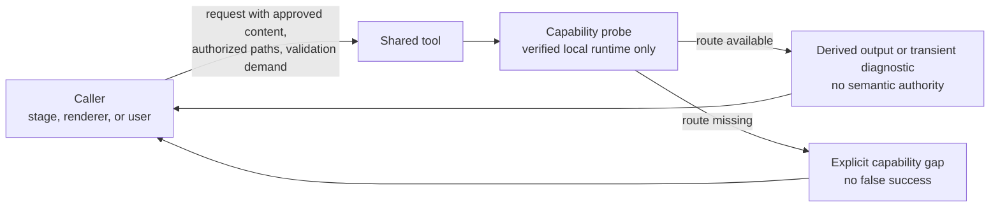

# Shared tools guide

The `tool` group holds ten mechanics skills that a workflow stage, renderer, or user can call within each skill's declared execution modes. A tool executes bounded mechanics — authoring, capture, parsing, editing, rendering, validating — while the caller keeps semantic ownership of the content. Every tool output is transient or derived: adopting it into project meaning is always the caller's decision.

This guide is an explanatory view. [`skill-manifest.yaml`](../../skill-manifest.yaml) is the registry for status, side effects, and approval policies; each `SKILL.md` owns its procedure.

## How a tool collaborates

A tool never installs a runtime silently, never reaches a remote converter, and never writes workflow state or the artifact index. When the needed local backend is missing, the result is a named gap, not a silent approximation.

## When to use each skill

| Skill | Use it when |
|---|---|
| [`q-tool-mermaid`](q-tool-mermaid/SKILL.md) | Creating, revising, validating, repairing, rendering, or compiling Mermaid diagrams. |
| [`q-tool-c4`](q-tool-c4/SKILL.md) | Modeling or rendering C4 views of a system, container, component, code area, dynamic flow, deployment, or landscape through a capability-verified Mermaid, Structurizr DSL, or C4-PlantUML route. |
| [`q-tool-marp`](q-tool-marp/SKILL.md) | Creating, reviewing, validating, or locally rendering Marp Markdown slides as an editable source bundle. |
| [`q-tool-web-markdown`](q-tool-web-markdown/SKILL.md) | Manually capturing one explicitly named public JavaScript-rendered page as bounded, derived Markdown. |
| [`q-tool-database-schema`](q-tool-database-schema/SKILL.md) | Designing or reviewing a physical schema, document model, migration, or supplied performance evidence, without executing database work. |
| [`q-tool-humanizer`](q-tool-humanizer/SKILL.md) | Detecting AI-writing indicators, humanizing prose, or improving English or Spanish clarity without changing facts, citations, or commitments. |
| [`q-tool-document`](q-tool-document/SKILL.md) | Inspecting, extracting, creating, exactly editing, commenting, redlining, accepting changes, converting, rendering, or validating DOCX/DOTX files. |
| [`q-tool-pdf`](q-tool-pdf/SKILL.md) | Inspecting, extracting, creating, transforming, filling, securing, rendering, OCRing, or validating a PDF. |
| [`q-tool-pptx`](q-tool-pptx/SKILL.md) | Inspecting, extracting, selecting, filling, rendering, or validating native PowerPoint files. |
| [`q-tool-spreadsheet`](q-tool-spreadsheet/SKILL.md) | Inspecting, extracting, creating, boundedly editing, converting, recalculating, rendering, or validating XLSX workbooks. |

## Backend routing notes

`q-tool-document`, `q-tool-pdf`, `q-tool-pptx`, and `q-tool-spreadsheet` select between capability-verified Python and Node backends per operation. `q-tool-pptx` parity is operation-specific: Python owns creation, slide selection, template fills, and contact sheets; Node owns inspection, extraction, structural checks, and the same native render wrapper. Each dispatcher falls back only before writing an output.

`q-tool-c4` chooses Mermaid by default, Structurizr DSL when one model must feed synchronized views, or C4-PlantUML when verified layout and styling controls are required. It never installs those runtimes implicitly.

## Boundaries

- Invoke `q-tool-web-markdown` only by its exact name with one exact public URL. It does not auto-trigger from links, authenticate, crawl, bypass controls, summarize, judge evidence, or give its Markdown semantic authority.
- Do not use `q-tool-marp` to decide report narrative, brand, slide purpose, release, or publication, and do not describe a standard Marp PPTX as object-editable.
- Do not use `q-tool-pptx` to decide a deck's narrative, claims, brand, slide purpose, release, or publication; route those decisions to the owning renderer or upstream content owner.
- Do not let spreadsheet mechanics choose formulas, assumptions, figures, financial conventions, or business meaning, or treat cached formula values or a LibreOffice conversion as proof of Excel fidelity.
- Do not let transient database candidates choose the engine, overwrite semantic or architecture owners, or execute database commands.
- Do not let `q-tool-humanizer` invent specificity for a vague claim or silently repair a suspicious citation; gaps and citation signals route to the evidence owner.

## Integration with the other groups

- [Planning stages](../plan/README.md): `q-plan-domain-model` and `q-plan-architecture` require `q-tool-mermaid`; architecture and features optionally use `q-tool-c4`; several planning and refinement stages optionally use `q-tool-database-schema`.
- [Proposal](../proposal/README.md) and [reporting](../report/README.md) renderers delegate DOCX, PDF, PPTX, and Marp mechanics to the matching tool while retaining narrative, channel, and release ownership.
- Every tool requires the `q-core-contract` companion. Optional collaborations are declared as manifest `uses` entries: when the tool is absent, the caller continues through its declared fallback and reports the capability gap.
