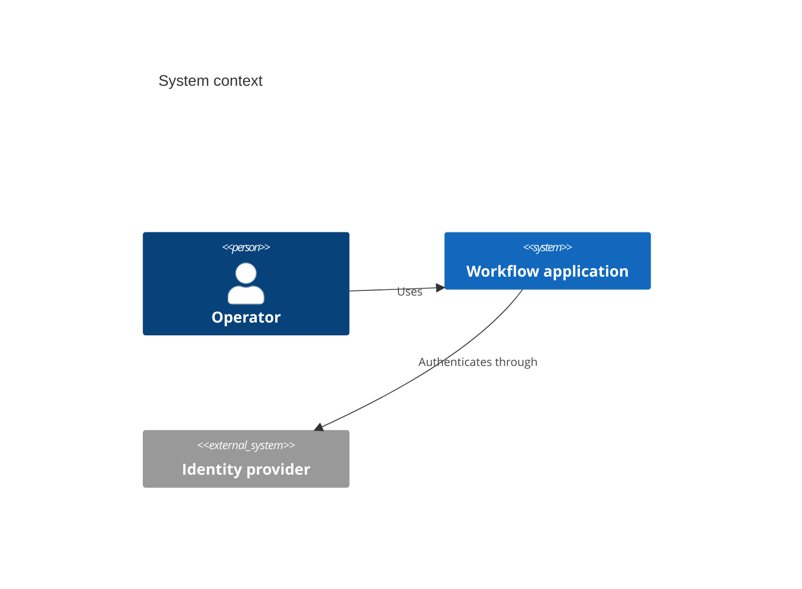

# C4

Use Mermaid C4 syntax for approved system-context or container views when the target renderer supports it. Prefer context and container levels; component and code levels often become too dense.

Preserve people, systems, containers, boundaries, and relationship labels from the architecture owner. If the target renderer lacks C4 support, encode the same approved elements in a portable flowchart and report the compatibility fallback.

